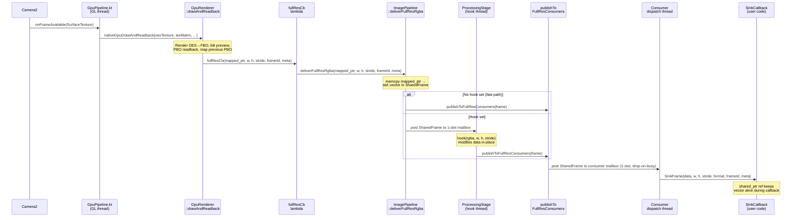
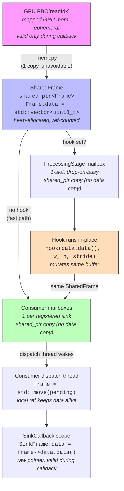

# Plan: Strip CPU Pipeline, Add ProcessingStage Hook

## Context

The GPU shader now handles all color transforms (brightness, contrast, saturation, gamma, black balance). The CPU pipeline (`ImagePipeline`) has a dead YUV->BGR processing path that's never invoked in the GPU flow. This refactor:
1. Removes all dead CPU processing code (~500 lines)
2. Replaces `cv::Mat` with `std::vector<uint8_t>` in the internal `Frame` struct (removes OpenCV dependency from the pipeline)
3. Adds an optional per-role `ProcessingStage` — a user-supplied hook that runs on a dedicated thread before consumer dispatch
4. Preserves the Dart→Pigeon→Kotlin→GPU shader uniform chain (no changes to color parameter flow)

## Code Flow (post-refactor)



The same pattern applies for tracker (480p) and raw (passthrough) streams via `deliverTrackerRgba` / `deliverRawRgba`.

## Data Flow / Buffer Ownership



**Concurrency guarantee**: When a consumer's dispatch thread does `frame = std::move(pending)`, it takes ownership of the `shared_ptr`. New frames overwrite the mailbox slot but do NOT affect the local ref. The consumer processes its frame safely while newer frames accumulate (and get dropped) in the slot. When the consumer loops back, it picks up the latest available frame.

**Total memcopies**: 1 (PBO → vector). The processing hook and consumer dispatch add only `shared_ptr` copies (pointer copy, no data copy).

---

## Implementation Steps

### Step 1: Delete InputRing files

**Delete entirely:**
- `packages/cambrian_camera/android/src/main/cpp/src/InputRing.h`
- `packages/cambrian_camera/android/src/main/cpp/src/InputRing.cpp`

No replacement needed — GPU PBO double-buffer handles frame timing.

### Step 2: Update CMakeLists.txt

**File:** `packages/cambrian_camera/android/src/main/cpp/CMakeLists.txt`

**Production target:**
- Remove `src/InputRing.cpp` from `add_library(cambrian_camera SHARED ...)`
- Remove `find_package(OpenCV REQUIRED core imgproc)`
- Remove `opencv_core` and `opencv_imgproc` from `target_link_libraries`
- Remove `c++_shared` from `target_link_libraries` (was only needed for OpenCV static libs; NDK toolchain provides it via `ANDROID_STL=c++_shared` in build.gradle.kts). Verify with `readelf -d libcambrian_camera.so` after build.

**Test target (`cambrian_camera_tests`, inside `if(NOT ANDROID)`):**
- Remove `src/InputRing.cpp` from `add_executable(cambrian_camera_tests ...)`
- Remove `opencv_core` and `opencv_imgproc` from `target_link_libraries(cambrian_camera_tests ...)`

**Verify first**: grep for `#include <opencv2` in all remaining .cpp/.h files to confirm nothing else uses OpenCV. GpuRenderer does not. After this refactor, ImagePipeline won't either.

### Step 3: Update cambrian_camera_native.h (public API)

**File:** `packages/cambrian_camera/android/src/main/cpp/include/cambrian_camera_native.h`

Add to the public API:
```cpp
/// Hook called on a dedicated processing thread before consumer dispatch.
/// Modify rgba data in-place. The buffer is valid for the duration of the call.
using FrameHookFn = std::function<void(uint8_t* rgba, int w, int h, int stride)>;
```

Add to `IImagePipeline`:
```cpp
/// Register an optional CPU processing hook for frames of the given role.
/// The hook runs on a dedicated thread; pass nullptr to clear.
virtual void setFrameHook(SinkRole role, FrameHookFn fn) = 0;
```

Remove `BGR` from `PixelFormat` enum (only `RGBA` remains).

### Step 4: Refactor ImagePipeline.h

**File:** `packages/cambrian_camera/android/src/main/cpp/src/ImagePipeline.h`

**Remove:**
- `#include "InputRing.h"`
- `#include <opencv2/core.hpp>`
- `ProcessingParams` struct (lines 36-41)
- `setPreviewWindow()`, `setRawPreviewWindow()` declarations
- `deliverYuv()` declaration
- `setParams()` declaration
- `processingLoop()` declaration
- All preview window members: `windowMu_`, `previewWindow_`, `rawPreviewWindow_`, `lastWidth_`, `lastHeight_`, `rawLastWidth_`, `rawLastHeight_`, `previewRgba_`, `rawPreviewRgba_`
- Processing param members: `paramsMu_`, `params_`
- Input ring / processing thread: `inputRing_`, `processingThread_`
- CPU consumer members: `consumersMu_`, `consumers_`, `rawConsumer_`
- CPU dispatch functions: `publishToConsumers()`, `publishToRawConsumer()`, `blitToWindow()`

**Add:**
```cpp
#include <vector>  // (if not already included)

/// Processing stage: optional dedicated thread with 1-slot mailbox.
/// When a hook is registered, frames are routed through here before consumers.
struct ProcessingStage {
    ProcessingStage() = default;
    ProcessingStage(const ProcessingStage&) = delete;
    ProcessingStage& operator=(const ProcessingStage&) = delete;

    FrameHookFn hook;                     // null = disabled
    std::atomic<bool> hookActive{false};  // atomic mirror of (hook != nullptr), safe to read from GL thread
    SharedFrame pending;                  // 1-slot mailbox
    std::mutex mu;
    std::condition_variable cv;
    std::thread thread;
    std::atomic<bool> running{false};
};
```

Add members:
```cpp
ProcessingStage fullResStage_;
ProcessingStage trackerStage_;
ProcessingStage rawStage_;
```

Add private helpers:
```cpp
void startProcessingStage(ProcessingStage& stage, /* publish fn */);
void shutdownProcessingStage(ProcessingStage& stage);
void routeFrame(ProcessingStage& stage, SharedFrame frame,
                void (ImagePipeline::*publishFn)(SharedFrame));

// Lock ordering (update existing comment at top of file):
// 1. windowMu_  (removed after this refactor)
// 2. fullResConsumersMu_ / trackerConsumersMu_ / rawConsumersMu_
// 2b. ProcessingStage::mu  (never nested with consumer vector mutexes)
// 3. Consumer::mu
// 4. paramsMu_  (removed after this refactor)
```

Add public method:
```cpp
void setFrameHook(SinkRole role, FrameHookFn fn) override;
```

**Modify Frame struct:**
```cpp
struct Frame {
    uint64_t id        = 0;
    FrameMetadata meta = {};
    std::vector<uint8_t> data;     // was: cv::Mat bgr
    int width  = 0;
    int height = 0;
    int stride = 0;
    PixelFormat format = PixelFormat::RGBA;
};
```

**Modify constructor:** `ImagePipeline()` — no parameters (no ANativeWindow, no dimensions).

### Step 5: Refactor ImagePipeline.cpp

**File:** `packages/cambrian_camera/android/src/main/cpp/src/ImagePipeline.cpp`

**Remove (~400 lines):**
- `#include <opencv2/imgproc.hpp>`
- `applySaturation()` function
- `setPreviewWindow()`, `setRawPreviewWindow()` implementations
- `blitToWindow()` implementation
- `setParams()` implementation
- `deliverYuv()` implementation
- `processingLoop()` implementation (entire function)
- `publishToConsumers()`, `publishToRawConsumer()` implementations
- Constructor: remove `__preview` consumer setup, `__raw_preview` consumer setup, `processingThread_` start, `previewWindow_` acquire
- Destructor: remove `inputRing_.shutdown()`, `processingThread_.join()`, `shutdownConsumer(rawConsumer_.get())`, preview window releases

**Modify constructor** to be minimal:
```cpp
ImagePipeline::ImagePipeline() {
    LOGD("ImagePipeline created (GPU dispatch mode)");
}
```

**Modify destructor:**
```cpp
ImagePipeline::~ImagePipeline() {
    shutdownProcessingStage(fullResStage_);
    shutdownProcessingStage(trackerStage_);
    shutdownProcessingStage(rawStage_);
    shutdownConsumers();
    LOGD("ImagePipeline destroyed");
}
```

**Modify deliverFullResRgba / deliverTrackerRgba / deliverRawRgba:**
Replace `cv::Mat` with `std::vector<uint8_t>`, add fast-path/hook routing:
```cpp
void ImagePipeline::deliverFullResRgba(const uint8_t* rgba, int w, int h,
                                        int stride, uint64_t frameId,
                                        const FrameMetadata& meta) {
    // Fast-path: skip if no consumers AND no hook.
    // Use hookActive (atomic) instead of reading hook (std::function) to avoid
    // data race with setFrameHook writing hook on another thread.
    {
        std::lock_guard<std::mutex> lk(fullResConsumersMu_);
        if (fullResConsumers_.empty() &&
            !fullResStage_.hookActive.load(std::memory_order_acquire)) return;
    }

    auto frame    = std::make_shared<Frame>();
    frame->id     = frameId;
    frame->meta   = meta;
    frame->width  = w;
    frame->height = h;
    frame->stride = stride;
    frame->format = PixelFormat::RGBA;
    // NOTE: Unlike the old cv::Mat path which stripped padding (copied w*4 per row),
    // this copies the full source stride. Today PBO stride == w*4, but assert to
    // catch future changes that introduce padding (consumers use stride field).
    assert(stride == w * 4 && "PBO stride has padding — verify consumers handle it");
    const size_t size = static_cast<size_t>(h) * stride;
    frame->data.resize(size);
    memcpy(frame->data.data(), rgba, size);

    routeFrame(fullResStage_, std::move(frame),
               &ImagePipeline::publishToFullResConsumers);
}
```

**Add routeFrame:**
```cpp
void ImagePipeline::routeFrame(ProcessingStage& stage, SharedFrame frame,
                               void (ImagePipeline::*publishFn)(SharedFrame)) {
    if (stage.running.load()) {
        // Route through processing stage
        std::lock_guard<std::mutex> lk(stage.mu);
        stage.pending = std::move(frame);
        stage.cv.notify_one();
    } else {
        // Fast path: direct dispatch
        (this->*publishFn)(std::move(frame));
    }
}
```

**Add ProcessingStage lifecycle:**
```cpp
void ImagePipeline::startProcessingStage(
        ProcessingStage& stage,
        void (ImagePipeline::*publishFn)(SharedFrame)) {
    if (stage.running.load()) return;  // already running
    stage.running = true;
    stage.thread = std::thread([this, &stage, publishFn]() {
        while (true) {
            SharedFrame frame;
            {
                std::unique_lock<std::mutex> lk(stage.mu);
                stage.cv.wait(lk, [&] {
                    return stage.pending || !stage.running.load();
                });
                if (!stage.running.load() && !stage.pending) break;
                frame = std::move(stage.pending);
            }
            if (frame && stage.hook) {
                try {
                    stage.hook(frame->data.data(), frame->width,
                               frame->height, frame->stride);
                } catch (const std::exception& e) {
                    LOGE("ProcessingStage hook threw: %s — frame passed unmodified", e.what());
                } catch (...) {
                    LOGE("ProcessingStage hook threw unknown exception — frame passed unmodified");
                }
            }
            if (frame) {
                (this->*publishFn)(std::move(frame));
            }
        }
    });
}

void ImagePipeline::shutdownProcessingStage(ProcessingStage& stage) {
    if (!stage.running.load()) return;
    stage.running = false;
    stage.cv.notify_all();
    if (stage.thread.joinable()) stage.thread.join();
    stage.pending.reset();  // Release any held frame immediately (can be ~48MB at 4K)
}

// NOTE: Not thread-safe against concurrent calls for the same role.
// Must be called from a single thread (Kotlin main thread in practice).
void ImagePipeline::setFrameHook(SinkRole role, FrameHookFn fn) {
    ProcessingStage* stage = nullptr;
    void (ImagePipeline::*publishFn)(SharedFrame) = nullptr;
    switch (role) {
        case SinkRole::FULL_RES:
            stage = &fullResStage_; publishFn = &ImagePipeline::publishToFullResConsumers; break;
        case SinkRole::TRACKER:
            stage = &trackerStage_; publishFn = &ImagePipeline::publishToTrackerConsumers; break;
        case SinkRole::RAW:
            stage = &rawStage_; publishFn = &ImagePipeline::publishToRawConsumers; break;
        default:
            LOGE("setFrameHook: unknown SinkRole %d", static_cast<int>(role));
            return;
    }
    shutdownProcessingStage(*stage);
    stage->hook = std::move(fn);
    stage->hookActive.store(static_cast<bool>(stage->hook), std::memory_order_release);
    if (stage->hook) {
        startProcessingStage(*stage, publishFn);
    }
}
```

**Modify startConsumerThread** — change `frame->bgr.data` to `frame->data.data()`:
```cpp
sf.data = frame->data.data();  // was: frame->bgr.data
```

**Modify shutdownConsumers** — remove `drainVector(consumersMu_, consumers_)` (CPU vector gone).

**Modify removeSink** — remove the `consumers_` search path (CPU vector gone).

### Step 6: Update CameraBridge.cpp

**File:** `packages/cambrian_camera/android/src/main/cpp/src/CameraBridge.cpp`

**Remove entirely:**
- `nativeSetPreviewWindow` function (lines 184-208)
- `nativeDeliverYuv` function (lines 232-276)
- `nativeSetProcessingParams` function (lines 283-305)

**Modify nativeInit** — remove `previewSurface`, `width`, `height` params:
```cpp
JNIEXPORT jlong JNICALL
Java_com_cambrian_camera_CameraController_nativeInit(
        JNIEnv* /*env*/, jclass /*clazz*/) {
    auto* pipeline = new cam::ImagePipeline();
    LOGD("nativeInit: pipeline=%p", pipeline);
    return static_cast<jlong>(reinterpret_cast<uintptr_t>(pipeline));
}
```

### Step 7: Update CameraController.kt

**File:** `packages/cambrian_camera/android/src/main/kotlin/com/cambrian/camera/CameraController.kt`

**Remove:**
- `nativeSetPreviewWindow` external declaration (lines 92-95)
- `nativeDeliverYuv` external declaration (lines 116-125)
- `nativeSetProcessingParams` external declaration (lines 131-137)
- YUV format constants (lines 80-83): `YUV_FORMAT_UNKNOWN`, `NV21`, `NV12`, `I420`
- `surfaceProducer.setCallback(...)` block (lines 264-281) — the `onSurfaceAvailable`/`onSurfaceCleanup` that calls `nativeSetPreviewWindow`. CPU preview is dead.

**Modify nativeInit declaration:**
```kotlin
@JvmStatic external fun nativeInit(): Long
```

**Modify nativeInit call site** (line 826):
```kotlin
nativePipelinePtr = nativeInit()
```
Remove the comment about passing null preview surface.

**Keep:** `rawSurfaceProducer.setCallback(...)` block (lines 283-300) — it uses `gpuPipeline?.rebindRawSurface()`.

### Step 8: Update tests

**C++ tests** — Update `SinkRoutingTest.cpp`:
- Change `cam::ImagePipeline pipeline(nullptr, 64, 64)` to `cam::ImagePipeline pipeline`
- Add test for `setFrameHook`: register hook that flips a byte, verify consumer sees modified data
- Add test for fast-path: verify frames arrive at consumer without hook
- Add test for hook lifecycle: set hook → deliver frames → clear hook (nullptr) → verify direct dispatch resumes

**C++ test helper** — Update `CameraBridge.cpp` `nativeGetLastDeliveredRgba`:
- Change `f.width * f.height * 4` to `f.stride * f.height` for the copy size, so it works correctly if stride ever differs from `w * 4`.

**Kotlin tests** — Update any mocks/verifications that reference `nativeSetPreviewWindow`, `nativeDeliverYuv`, or `nativeSetProcessingParams`.

**Dart tests** — No changes needed (ProcessingParams and Pigeon chain are untouched).

---

## Execution Order

```
Step 1 (delete InputRing) ──┐
Step 2 (CMakeLists.txt)  ───┤
Step 3 (public API header) ─┤── can be done in parallel
Step 6 (CameraBridge.cpp) ──┘
         │
         ▼
Step 4 (ImagePipeline.h) ── must come before Step 5
         │
         ▼
Step 5 (ImagePipeline.cpp) ── largest change
         │
         ├── Step 7 (CameraController.kt) ── can be done in parallel with Step 5
         │
         ▼
Step 8 (tests)
```

## Verification

1. `flutter analyze` — must pass clean
2. `flutter build apk` — must compile (verifies NDK build, Kotlin, Dart)
3. `flutter test` — existing tests pass
4. Run on device — both raw and processed previews display, sliders adjust GPU params
5. Verify no OpenCV symbols in the built `.so`: `nm -D libcambrian_camera.so | grep -i opencv` should return nothing

## Risks

1. **OpenCV removal** — If any external consumer plugin transitively depends on OpenCV symbols from the pipeline `.so`, removing OpenCV from `target_link_libraries` will break it. Verify with `nm` on the built library.
2. **JNI name stability** — Removing parameters from `nativeInit` changes the Java method descriptor but NOT the mangled C function name (`Java_com_cambrian_camera_CameraController_nativeInit`). However, the JNI parameter list in the C function must match exactly. The old signature had `(JNIEnv*, jclass, jobject, jint, jint)` and the new one is `(JNIEnv*, jclass)`. This is a breaking ABI change — old Kotlin code calling new native code (or vice versa) will crash. Both sides must be updated atomically.
3. **ProcessingStage lifecycle** — The hook thread starts lazily on `setFrameHook(role, fn)` and joins on `setFrameHook(role, nullptr)` or destructor. The `running` atomic must be set to `false` before `notify_all` to avoid a wake-then-check race.
4. **Data race on hook read (mitigated)** — The GL thread's fast-path check must never read `stage.hook` (a `std::function`) directly. The `hookActive` atomic added above solves this. Without it, concurrent `setFrameHook` + `deliver*Rgba` is undefined behavior.
5. **Hook exception safety (mitigated)** — User-supplied hooks that throw would kill the process via `std::terminate`. The try/catch added above keeps the processing thread alive.
6. **Stride semantics change** — The old code produced packed frames (`stride == w * 4`). The new code preserves source stride. An assert guards against unexpected padding. If PBO stride changes in the future, consumers and the CameraBridge test helper (`nativeGetLastDeliveredRgba`) must be audited.
7. **`setFrameHook` concurrency** — Not safe to call from multiple threads for the same role simultaneously. In practice only called from Kotlin main thread. Documented in code comment above the function.
8. **Frame gap during hook swap** — Between `shutdownProcessingStage` and `startProcessingStage` in `setFrameHook`, frames bypass the hook and go directly to consumers. This window is typically < 1ms and acceptable for hook reconfiguration.
