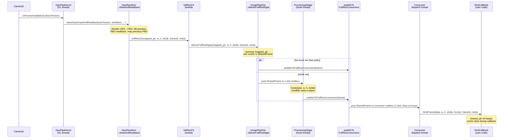
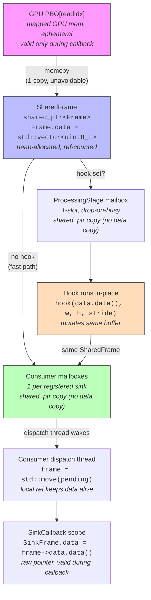

# Camera2 Flutter Plugin Architecture v2

## Context

We're designing a unified Flutter plugin (`cambrian_camera`) for controlling a camera on Android (Camera2) with real-time C++ post-processing. The library captures frames, applies user-configurable image adjustments (brightness, saturation, gamma, white balance, etc.), and delivers post-processed frames to both a preview display and any number of native C++ consumers via ring buffers.

**The library is use-case agnostic.** It knows nothing about stitching, tracking, or any specific application. Applications register their own C++ consumers with the configuration they need (resolution, channels, ring size, drop policy). Two known applications:
- A whole-slide imaging scanner performing real-time CV (tracking at low-res, stitching at 4K)
- A slide annotation app capturing and annotating high-quality images

Both need user-adjustable post-processing visible in the preview. The image in the preview is pixel-identical to what consumers receive.

Only Android (Camera2) is implemented initially. The Dart API is platform-agnostic for future iOS support.

---

## Architecture Overview (6 Layers)

```
┌─────────────────────────────────────────────────────────────┐
│  L1: Dart Public API          (packages/cambrian_camera/lib)│
│  CambrianCamera, CameraSettings, ProcessingParams, streams  │
└──────────────────────────┬──────────────────────────────────┘
                           │ Pigeon-generated type-safe interface
┌──────────────────────────┴──────────────────────────────────┐
│  L2: Platform Interface   (Pigeon @HostApi / @FlutterApi)    │
│  CameraHostApi → Kotlin, CameraFlutterApi → Dart callbacks   │
└──────────────────────────┬──────────────────────────────────┘
                           │ Generated Kotlin bindings
┌──────────────────────────┴──────────────────────────────────┐
│  L3: Kotlin FlutterPlugin (CambrianCameraPlugin.kt)          │
│  FlutterPlugin + ActivityAware, TextureRegistry, Pigeon host │
└──────────────────────────┬──────────────────────────────────┘
                           │ direct Kotlin calls
┌──────────────────────────┴──────────────────────────────────┐
│  L4: Kotlin CameraController                                 │
│  Camera2 lifecycle, ImageReader, per-request ISP settings,   │
│  auto-recovery state machine                                 │
└──────────────────────────┬──────────────────────────────────┘
                           │ JNI (DirectByteBuffer + flat arrays)
┌──────────────────────────┴──────────────────────────────────┐
│  L5: C++ JNI Bridge  (CameraBridge.cpp)                      │
│  Deserialize metadata, wrap buffers, call pipeline           │
└──────────────────────────┬──────────────────────────────────┘
                           │ C++ calls
┌──────────────────────────┴──────────────────────────────────┐
│  L6: C++ ImagePipeline                                       │
│  Post-processing, preview output, generic consumer fan-out   │
└─────────────────────────────────────────────────────────────┘
```

---

## Key Design Decisions

### Pigeon over raw MethodChannel

Raw MethodChannel with string-based method names and `Map<String, dynamic>` payloads is error-prone — typos, missing arguments, and type mismatches are caught only at runtime. Pigeon generates type-safe Dart and Kotlin code from a shared interface definition, eliminating this class of bugs.

`@FlutterApi` replaces EventChannel for state/error callbacks.

### YUV_420_888 for streaming

`YUV_420_888` is the streaming format. At session setup `resolveStreamFormat()` queries `StreamConfigurationMap.getOutputSizes(YUV_420_888)`, selects the largest 4:3 size (matching the sensor's native aspect ratio for highest quality), and falls back to 1280×960 if no 4:3 size is advertised. The chosen resolution is reported in `CameraCapabilities.yuvStreamWidth` / `yuvStreamHeight`.

### Per-request ISP settings

All CameraSettings (ISO, exposure, focus, WB, zoom, NR, edge mode) map to per-request CaptureRequest keys. Changing them rebuilds the repeating request — no session reconfiguration needed.

Session-level changes (stream format/size/buffer count) trigger a full stop/start cycle, but these are rare (only at initialization or explicit resolution change).

### SurfaceProducer for preview

The preview Surface comes from Flutter's `TextureRegistry.SurfaceProducer`:

```
Flutter Texture widget
    ↓ (textureId = SurfaceProducer.id, stable across surface recreations)
TextureRegistry.SurfaceProducer
    ↓ getSurface()
Camera2 repeating CaptureRequest target
    ↓ (Camera2 writes YUV frames directly into the Surface)
SurfaceProducer → Flutter compositor re-renders
```

Camera2 writes directly into the `SurfaceProducer` surface as a `CaptureRequest` target — no C++ memcpy on the preview path. JNI is used only for frame delivery to the C++ pipeline (Phase 4+).

### Generic consumer model (no use-case knowledge)

The library does NOT have hardcoded "stitcher" or "tracker" outputs. Instead, it provides a generic consumer sink registry. Application C++ code registers sinks with the configuration it needs. The library handles downscaling, channel extraction, and ring buffer management per-sink.

### Auto-recovery

The library handles camera errors internally with exponential backoff retry. The Dart layer receives state transitions (including `recovering`) and informational errors, but does not need to implement recovery logic.

---

## Dart Public API

```dart
class CambrianCamera {
  /// Opens camera and starts the pipeline. Single step to a working camera.
  static Future<CambrianCamera> open({
    String? cameraId,
    CameraSettings? settings,
    bool enableRawStream = false,
    int rawStreamHeight = 0,
  });

  /// Closes camera and releases all resources.
  Future<void> close();

  /// Emits the Flutter texture ID for the color-processed preview.
  /// Apps render it with Flutter's Texture widget.
  Stream<CameraTextureInfo> get toneMappedTexture;

  /// Emits the Flutter texture ID for the raw (passthrough) preview.
  /// Only emits if enableRawStream: true was passed to open().
  Stream<CameraTextureInfo> get rawTexture;

  /// Camera state transitions (ready, streaming, recovering, error).
  Stream<CameraState> get stateStream;

  /// Error events. Non-fatal errors (auto-recovering) are informational.
  /// Fatal errors (permission revoked, camera disabled) require app action.
  Stream<CameraError> get errorStream;

  /// Device capabilities, available after open().
  CameraCapabilities get capabilities;

  /// Update ISP-level camera settings (ISO, exposure, focus, WB, zoom).
  /// Uses latest-value-wins serialization — no artificial latency.
  Future<void> updateSettings(CameraSettings settings);

  /// Unique identifier for this camera instance (also the Flutter texture ID).
  int get id;

  /// Update C++ pipeline processing parameters (brightness, gamma, saturation, etc.).
  /// Returns a Future that completes when the channel round-trip finishes.
  /// Callers may await to observe errors or ignore for fire-and-forget semantics.
  Future<void> setProcessingParams(ProcessingParams params);

  /// Capture a high-quality still image. Returns the file path.
  Future<String> takePicture();

  /// Returns the native pipeline pointer for C++ consumer registration, or null
  /// if the pipeline is not yet initialized.
  Future<int?> getNativePipelineHandle();
}
```

### CameraSettings

Maps to per-request CaptureRequest keys. Auto-capable settings use sealed types so the three
states (don't change / auto / manual) are explicit at compile time:

```dart
class CameraSettings {
  final AutoValue<int>? iso;          // AutoValue.auto() | AutoValue.manual(800)
  final AutoValue<int>? exposureTimeNs; // nanoseconds; auto is contagious with iso
  final AutoValue<double>? focus;     // diopters; AutoValue.auto() = continuous AF
  final WhiteBalance? whiteBalance;   // WhiteBalance.auto() | .locked() | .manual(gainR,gainG,gainB)
  final double? zoomRatio;
  final NoiseReductionMode? noiseReductionMode; // off / fast / highQuality / minimal / zeroShutterLag
  final EdgeMode? edgeMode;           // off / fast / highQuality / zeroShutterLag
  final int? evCompensation;          // steps; no effect when AE is disabled
}
```

`null` means "don't change" — the Kotlin side accumulates settings so omitted fields
retain their previous values. ISO and exposure share a single Camera2 AE flag: setting
either to `auto` propagates to the other automatically.

### ProcessingParams

Maps to C++ pipeline controls:

```dart
class ProcessingParams {
  final double blackR, blackG, blackB;   // [0.0, 0.5] per-channel black level
  final double gamma;                     // [0.1, 4.0], 1.0 = identity
  final double brightness;               // [-1.0, +1.0]
  final double saturation;               // [0, 3], 1.0 = identity
}
```

Note: no `trackingScale` — downscaling is per-consumer, configured at the C++ level.

### CameraState

```dart
enum CameraState {
  closed,       // camera not open
  opening,      // initializing
  streaming,    // actively delivering frames
  recovering,   // error occurred, auto-recovering
  error,        // fatal error, requires app action
}
```

### CameraCapabilities

```dart
class CameraCapabilities {
  final List<CameraSize> supportedSizes;
  final int isoMin, isoMax;
  final int exposureTimeMinNs, exposureTimeMaxNs;
  final double focusMin, focusMax;
  final double zoomMin, zoomMax;
  final int evCompMin, evCompMax;
  final double evCompensationStep;
  final int yuvStreamWidth, yuvStreamHeight;  // resolution chosen by resolveStreamFormat()
  // Raw stream fields — all 0 when raw is disabled (enableRawStream: false or raw init failed)
  final int rawStreamTextureId;   // Flutter texture ID for raw preview; 0 when disabled
  final int rawStreamWidth;       // auto-computed from aspect ratio; 0 when disabled
  final int rawStreamHeight;      // matches rawStreamHeight passed to open(); 0 when disabled
}
```

### CameraError

```dart
class CameraError {
  final CameraErrorCode code;
  final String message;
  final bool isFatal;   // false = informational (auto-recovering)
}

enum CameraErrorCode {
  cameraDevice,          // hardware error
  cameraService,         // system service error
  cameraDisconnected,    // USB disconnect, system reclaim
  configurationFailed,   // session config failed
  permissionDenied,      // fatal
  cameraDisabled,        // system policy, fatal
  maxCamerasInUse,       // fatal
  previewSurfaceLost,    // recovering
  pipelineError,         // C++ processing error
}
```

---

## C++ Native Consumer API

### Public header: `cambrian_camera_native.h`

This header is the contract between the library and application C++ code. It does NOT include OpenCV or any library internals.

```cpp
#pragma once
#include <cstdint>
#include <functional>
#include <string>

namespace cam {

// ---- Frame metadata (subset relevant to consumers) ----

struct FrameMetadata {
    int64_t frameNumber;
    int64_t sensorTimestampNs;      // monotonic, same clock as IMU
    int64_t exposureTimeNs;
    int32_t iso;

    // Focus
    float focusDistanceDiopters;
    float depthOfFieldNearM;
    float depthOfFieldFarM;

    // Lens
    float focalLengthMm;
    float aperture;
    float zoomRatio;

    // White balance
    float wbGains[4];               // [R, G_even, G_odd, B]
    float colorMatrix[9];           // row-major 3x3
    int32_t colorTemperatureK;

    // Intrinsics (camera calibration)
    float fx, fy, cx, cy, skew;
    float distortion[5];            // Brown-Conrady k[5]
    int32_t intrinsicWidth;         // resolution intrinsics were computed for
    int32_t intrinsicHeight;

    // Geometry
    int32_t sensorOrientation;
    int32_t cropX, cropY, cropW, cropH;

    // State
    int32_t aeState;
    int32_t afState;
    int32_t awbState;
    int64_t rollingShutterSkewNs;
    int64_t frameDurationNs;
};

// ---- Consumer sink types ----

struct SinkFrame {
    const uint8_t* data;
    int width;
    int height;
    int stride;                     // bytes per row
    int channels;                   // 4=RGBA, 1=single channel
    FrameMetadata meta;
    std::function<void()> release;  // MUST be called when done with frame data
};

enum class SinkRole {
    FULL_RES,   // processed frames (color shader output) — default
    TRACKER,    // processed frames, typically at lower resolution
    RAW,        // passthrough frames (no color math, bit-exact RGBA from rawFBO)
                // only delivers frames when enableRawStream: true was passed to open()
};

struct SinkConfig {
    std::string name;               // application-defined label (for logging)
    SinkRole role = SinkRole::FULL_RES; // which render path this sink receives
    int width  = 0;                 // 0 = match source (full resolution)
    int height = 0;                 // 0 = match source
    int channels = 4;              // 4=RGBA, 1=single channel
    int channelIndex = -1;          // which channel to extract when channels=1
                                    // -1=all (requires channels=4), 0=R, 1=G, 2=B, 3=A
    int ringSize = 4;              // number of pre-allocated ring buffer slots
    bool dropOnFull = true;         // true: silently drop frame
                                    // false: log warning (backpressure signal)
};

using SinkCallback = std::function<void(SinkFrame&)>;

// ---- Pipeline interface ----

class IImagePipeline {
public:
    virtual ~IImagePipeline() = default;

    /// Register a consumer sink. Returns a sink ID (>= 0).
    /// Thread-safe. Can be called before or after streaming starts.
    virtual int addSink(const SinkConfig& config, SinkCallback callback) = 0;

    /// Remove a previously registered sink. Thread-safe.
    /// Blocks until any in-flight callback for this sink completes.
    virtual void removeSink(int sinkId) = 0;

    // Pipeline lifecycle and other methods are library-internal.
    // Consumers only interact via addSink/removeSink and the SinkCallback.
};

/// Get the pipeline instance. Returns nullptr if the library hasn't initialized yet.
/// Application native code calls this to register consumers.
IImagePipeline* getPipeline();

} // namespace cam
```

### Consumer registration example (application code)

```cpp
// In the application's native library (e.g., stitcher_jni.cpp)
#include <cambrian_camera_native.h>

static int g_stitchSinkId = -1;
void registerConsumers() {
    auto* pipeline = cam::getPipeline();
    if (!pipeline) return;

    // Full-res RGBA for stitching
    pipeline->addSink({"stitcher", cam::SinkRole::FULL_RES},
                      [](const cam::SinkFrame& frame) {
        // frame.data = full-res RGBA, valid for duration of this callback
    });

    // 480p downscaled RGBA for tracking
    pipeline->addSink({"tracker", cam::SinkRole::TRACKER},
                      [](const cam::SinkFrame& frame) {
        // frame.data = 480p-height RGBA
    });

    // Raw passthrough sink (only when enableRawStream: true was passed to open())
    pipeline->addSink({"raw_writer", cam::SinkRole::RAW},
                      [](const cam::SinkFrame& frame) {
        // frame.data = passthrough RGBA from rawFBO, no shader adjustments
    });
}
```

### Linking

The application's `CMakeLists.txt` links against the camera library's shared object:

```cmake
# Application CMakeLists.txt
find_library(cambrian-camera cambrian_camera)
target_link_libraries(my_app ${cambrian-camera})
target_include_directories(my_app PRIVATE ${cambrian_camera_INCLUDE_DIR})
```

Alternative: the Dart layer calls `getNativePipelineHandle()` and passes the pointer to the app's native code via FFI, avoiding the need to link directly.

---

## Pigeon Interface Definition

```dart
// pigeons/camera_api.dart

import 'package:pigeon/pigeon.dart';

@ConfigurePigeon(PigeonOptions(
  dartOut: 'lib/src/messages.g.dart',
  kotlinOut: 'android/src/main/kotlin/com/cambrian/camera/Messages.g.kt',
  kotlinOptions: KotlinOptions(package: 'com.cambrian.camera'),
))

// ---- Data classes ----

class CamSettings {
  // Mode strings: "auto" | "manual" | null (null = don't change)
  String? isoMode;
  int? iso;                      // value when isoMode == "manual"
  String? exposureMode;
  int? exposureTimeNs;           // nanoseconds when exposureMode == "manual"
  String? focusMode;
  double? focusDistanceDiopters; // when focusMode == "manual"
  String? wbMode;                // "auto" | "locked" | "manual" | null
  double? wbGainR, wbGainG, wbGainB; // when wbMode == "manual"
  double? zoomRatio;
  String? noiseReductionMode;
  String? edgeMode;
  int? evCompensation;
}

class PigeonProcessingParams {
  double blackR = 0;
  double blackG = 0;
  double blackB = 0;
  double gamma = 1.0;
  double brightness = 0;
  double saturation = 1.0;
}

class PigeonCameraCapabilities {
  // ranges, supported sizes, format info, memory estimate
}

class PigeonCameraState {
  String state;  // "closed", "opening", "streaming", "recovering", "error"
}

class PigeonCameraError {
  String code;
  String message;
  bool isFatal;
}

// ---- Host API (Dart → Kotlin) ----

@HostApi()
abstract class CameraHostApi {
  @async
  int open(String? cameraId, PigeonCameraSettings? settings);

  @async
  PigeonCameraCapabilities getCapabilities(int handle);

  void updateSettings(int handle, PigeonCameraSettings settings);

  void setProcessingParams(int handle, PigeonProcessingParams params);

  @async
  String takePicture(int handle);

  @async
  int getNativePipelineHandle(int handle);

  @async
  void close(int handle);
}

// ---- Flutter API (Kotlin → Dart) ----

@FlutterApi()
abstract class CameraFlutterApi {
  void onStateChanged(int handle, PigeonCameraState state);
  void onError(int handle, PigeonCameraError error);
}
```

---

## Auto-Recovery State Machine

Implemented in Kotlin CameraController. The library handles camera errors internally.

```
                    ┌──────────┐
                    │  CLOSED  │
                    └────┬─────┘
                         │ open()
                    ┌────▼─────┐
                    │ OPENING  │
                    └────┬─────┘
                         │ camera opened + session configured
                    ┌────▼──────┐
              ┌────►│ STREAMING │◄────────────────┐
              │     └────┬──────┘                  │
              │          │ error detected           │
              │     ┌────▼───────┐                 │
              │     │ RECOVERING │─────────────────┘
              │     └────┬───────┘  success (retry)
              │          │ max retries exceeded
              │     ┌────▼─────┐
              │     │  ERROR   │  (fatal — app must close/reopen)
              │     └──────────┘
              │
              └── close() from any state → CLOSED
```

### Recovery behavior

```
error detected → state = RECOVERING (emitted to Dart stateStream)
  → teardown camera resources
  → wait (exponential backoff: 500ms, 1s, 2s, 4s, max 8s)
  → attempt reinit (open device, configure session, rebind preview)
  → success: resume STREAMING, reset backoff counter
  → fail: increment backoff, retry
  → after 5 failures: emit fatal error to Dart, state = ERROR
```

### Auto-recover from:
- `CameraDevice.StateCallback.onError(ERROR_CAMERA_DEVICE | ERROR_CAMERA_SERVICE)`
- `CameraDevice.StateCallback.onDisconnected()` — USB cameras, system reclaim
- `CameraCaptureSession.StateCallback.onConfigureFailed()`
- `SurfaceProducer.Callback.onSurfaceAvailable()` — Flutter surface recycled (rebind capture session to new Surface)

### Do NOT auto-recover from (emit as fatal):
- `ERROR_CAMERA_DISABLED` — system policy
- Permission revoked at runtime
- `ERROR_MAX_CAMERAS_IN_USE` — another app has exclusive access

### Preview rebinding

When the `SurfaceProducer` surface is invalidated (hot restart, activity recreation):
1. Flutter calls `SurfaceProducer.Callback.onSurfaceAvailable()` with the new Surface
2. `CameraController` calls `rebindYuvPreviewSurface(newSurface)`
3. Previous capture session is closed; a new session is created with `newSurface` as the repeating request target
4. `SurfaceProducer.id` (= texture ID) is stable — Dart does not need to rebuild the `Texture` widget

---

## Settings Update Strategies

### CameraSettings (ISP-level: ISO, exposure, focus, WB, zoom)

**Latest-value-wins serializer** (NOT a time-based debounce).

Each setting change requires a Dart → Kotlin → Camera2 `setRepeatingRequest` round trip. If a new value arrives while the previous is in-flight, the old pending value is replaced. No artificial latency is added.

```dart
// Internally in the platform implementation:
class CameraSettingsSerializer {
  PigeonCameraSettings? _pending;
  bool _inFlight = false;

  void send(PigeonCameraSettings settings) {
    if (_inFlight) {
      _pending = settings;  // replace, don't queue
      return;
    }
    _inFlight = true;
    _hostApi.updateSettings(handle, settings).then((_) {
      _inFlight = false;
      if (_pending != null) {
        final next = _pending!;
        _pending = null;
        send(next);
      }
    });
  }
}
```

### ProcessingParams (C++ pipeline: brightness, gamma, saturation)

**Fire-and-forget. No serialization.**

These are applied in C++ via a mutex-protected struct copy. The next frame picks up the new values. The Dart → Kotlin → JNI → C++ `setParams()` path is a direct pass-through. One platform channel call per slider tick is negligible compared to the 30fps frame pipeline.

```dart
// In CambrianCamera:
void setProcessingParams(ProcessingParams params) {
  // Synchronous call to platform — no await, no queue
  _hostApi.setProcessingParams(_handle, params.toPigeon());
}
```

---

## C++ Pipeline Internals

### Dual-path GPU rendering

The GPU renderer runs two shader passes per frame when `enableRawStream` is active:

```
Camera2 → SurfaceTexture → OES texture
  ├── [color shader]       → processedFBO → preview surface + FULL_RES/TRACKER sinks
  └── [passthrough shader] → rawFBO(rawH) → raw preview surface + RAW sinks
```

**Processed path** (always active): The color shader applies all `ProcessingParams` (black balance, brightness, contrast, saturation, gamma) and renders into `processedFBO`. The preview surface and all `FULL_RES`/`TRACKER` sinks receive this output.

**Raw path** (optional, enabled by `rawW_ > 0`): The passthrough shader applies no shader adjustments — output is the Camera2/SurfaceTexture image as-is in RGBA. Rendered into `rawFBO` at `rawStreamHeight` resolution. The raw preview surface and all `RAW` sinks receive this output.

**Failure handling:** If raw initialization fails (EGL surface creation, FBO setup, shader compilation), the failure is logged, `rawW_` is set to `0`, and the processed pipeline continues normally. Callers can confirm raw is active by checking `capabilities.rawStreamWidth > 0` after `open()`.

**Resource budget (raw path):** All raw resources are allocated only when `rawW_ > 0`:

| Resource | Description |
|----------|-------------|
| `rawFBO` | Framebuffer object at `rawW_ × rawH_` RGBA |
| `rawPBOs[2]` | Two pixel buffer objects for async readback (double-buffered) |
| `rawEGLSurface` | Optional EGL surface for raw preview rendering |

Raw resources are released when the pipeline is torn down or when raw init fails.

### Frame delivery code flow (post-GPU readback)



The same pattern applies for tracker (480p) and raw (passthrough) streams via `deliverTrackerRgba` / `deliverRawRgba`.

### Buffer ownership and memory flow



**Total memcopies:** 1 (PBO → vector). The processing hook and consumer dispatch add only `shared_ptr` copies — pointer copy, no data copy.

**Concurrency guarantee:** When a consumer's dispatch thread does `frame = std::move(pending)`, it takes ownership of the `shared_ptr`. New frames overwrite the mailbox slot but do NOT affect the local ref. The consumer processes its frame safely while newer frames accumulate (and get dropped) in the slot.

### Processing stages (applied to every frame on the processed path)

1. **Black balance** — per-channel level subtraction: `pixel[ch] = max(0, pixel[ch] - blackLevel[ch])`
2. **White balance gains** — per-channel multiply: `pixel[R,G,B] *= wbGains[R,G,B]`
3. **Gamma + histogram + brightness** — single pre-computed 256-entry LUT per channel
4. **Saturation** — RGB luminance-deviation method (NOT HSV conversion)

Stages 2-4 are fused into the LUT where possible. The LUT is rebuilt atomically when ProcessingParams change.

### LUT precomputation

```cpp
void rebuildLUT(const ProcessingParams& p) {
    for (int i = 0; i < 256; ++i) {
        float v = i / 255.0f;
        v = pow(v, 1.0f / p.gamma);
        v = clamp(v + p.brightness, 0, 1);
        lut_[i] = static_cast<uint8_t>(v * 255);
    }
}
```

### Saturation (RGB luminance-deviation, NOT HSV)

The reference approach converts RGBA→BGR→HSV→scale S→HSV→BGR→RGBA (4 color space conversions at 4K). Replace with direct RGB saturation:

```cpp
// Per pixel (fused into main loop):
float lum = 0.299f * R + 0.587f * G + 0.114f * B;
R = clamp(lum + sat * (R - lum), 0, 255);
G = clamp(lum + sat * (G - lum), 0, 255);
B = clamp(lum + sat * (B - lum), 0, 255);
```

3 multiplies + 3 adds per pixel instead of 4 color space conversions. Preserves luminance, which is more correct for scientific imaging.

### Generic consumer fan-out

After post-processing, the pipeline fans out to:
1. **Preview** — ANativeWindow_lock → memcpy → unlockAndPost
2. **Registered sinks** — for each sink, apply per-sink transforms (downscale, channel extraction), write to ring slot, invoke callback

```cpp
void fanOut(const cv::Mat& processed, const FrameMetadata& meta) {
    writeToPreview(processed);

    std::lock_guard<std::mutex> lk(sinksMu_);
    for (auto& [id, sink] : sinks_) {
        auto* slot = sink.ring.acquire();
        if (!slot) {
            if (!sink.config.dropOnFull)
                LOGW("Sink '%s' ring full — frame dropped", sink.config.name.c_str());
            continue;
        }

        // Apply per-sink transforms
        cv::Mat output = processed;
        if (sink.config.width > 0 && sink.config.height > 0) {
            cv::resize(processed, sink.resizeBuf,
                       cv::Size(sink.config.width, sink.config.height),
                       0, 0, cv::INTER_LINEAR);
            output = sink.resizeBuf;
        }
        if (sink.config.channels == 1 && sink.config.channelIndex >= 0) {
            extractChannel(output, slot->buffer.data(), sink.config.channelIndex);
            // ... build SinkFrame with channels=1
        } else {
            memcpy(slot->buffer.data(), output.data, output.total() * output.elemSize());
            // ... build SinkFrame with channels=4
        }

        SinkFrame frame = buildSinkFrame(slot, sink, meta);
        sink.callback(frame);
    }
}
```

### Ring buffer design

```cpp
template<typename Slot>
class SlotRing {
    std::vector<Slot> slots_;
    std::mutex mu_;
    // Use shared_ptr so done() closures are safe even if ring is destroyed
    std::shared_ptr<State> state_;

public:
    Slot* acquire();            // returns nullptr if all in use
    void release(Slot* slot);   // marks slot as available
};
```

The `release` function captured in `SinkFrame::release` holds a `shared_ptr` to the ring state, preventing use-after-free if the pipeline is destroyed while a consumer holds a frame.

### Memory management

All ring buffers are pre-allocated at sink registration time. No per-frame allocation.

Memory per sink = `width × height × channels × ringSize`

Example budget for the WSI scanner app (4K = 3840×2160):

| Sink | Resolution | Channels | Ring | Memory |
|------|-----------|----------|------|--------|
| Input ring (ImageReader) | 3840×2160 | 4 (RGBA) | 4 | 133 MB |
| ANativeWindow (preview) | 3840×2160 | 4 (RGBA) | 2 | 66 MB |
| "stitcher" consumer | 3840×2160 | 4 (RGBA) | 4 | 133 MB |
| "tracker" consumer | 960×540 | 1 (green) | 8 | 4 MB |
| **Total (processed only)** | | | | **~336 MB** |

When the raw stream is enabled, additional GPU memory is allocated for the raw path (not counted above):

| Resource | Resolution | Memory |
|----------|-----------|--------|
| rawFBO | rawW × rawH RGBA | e.g., ~8 MB at 1920×1080 |
| rawPBOs[2] (double-buffered) | rawW × rawH RGBA | e.g., ~16 MB at 1920×1080 |
| rawEGLSurface (optional) | rawW × rawH | ~8 MB at 1920×1080 |

---

## JNI Metadata Layout

Flat arrays for zero-allocation metadata transfer. Layout defined in shared constant files.

### MetadataLayout.kt / MetadataLayout.h

Single source of truth for array indices:

```kotlin
// MetadataLayout.kt
object MetadataLayout {
    const val FLOAT_COUNT = 26
    const val FLOAT_FOCUS_DISTANCE = 0
    const val FLOAT_DOF_NEAR = 1
    const val FLOAT_DOF_FAR = 2
    const val FLOAT_FOCAL_LENGTH = 3
    // ... all indices
    const val LONG_COUNT = 5
    const val INT_COUNT = 23
}
```

```cpp
// MetadataLayout.h
namespace cam::meta {
    constexpr int FLOAT_COUNT = 26;
    constexpr int FLOAT_FOCUS_DISTANCE = 0;
    constexpr int FLOAT_DOF_NEAR = 1;
    // ... mirrors Kotlin exactly
}
static_assert(cam::meta::FLOAT_COUNT == 26, "Layout mismatch");
```

### Future optimization (Phase 6)

Replace flat arrays with a packed struct in a shared DirectByteBuffer:

```cpp
struct __attribute__((packed)) PackedMetadata {
    int64_t frameNumber;
    int64_t sensorTimestampNs;
    // ... all fields in fixed order
};
static_assert(sizeof(PackedMetadata) == EXPECTED_SIZE);
```

Kotlin writes via `ByteBuffer.putLong/putFloat/putInt`. C++ casts `GetDirectBufferAddress` to `PackedMetadata*`. Zero deserialization.

---

## Plugin File Structure

```
packages/cambrian_camera/
├── pubspec.yaml
├── pigeons/
│   └── camera_api.dart                  # Pigeon interface definition
├── lib/
│   ├── cambrian_camera.dart             # barrel export
│   └── src/
│       ├── cambrian_camera_controller.dart   # CambrianCamera class
│       ├── cambrian_camera_preview.dart      # buildPreview() widget
│       ├── camera_settings.dart              # CameraSettings, ProcessingParams
│       ├── camera_state.dart                 # CameraState, CameraCapabilities, CameraError
│       ├── camera_settings_serializer.dart   # Latest-value-wins for CameraSettings
│       └── messages.g.dart                   # Generated by Pigeon
├── android/
│   ├── build.gradle.kts
│   └── src/main/
│       ├── AndroidManifest.xml
│       ├── kotlin/com/cambrian/camera/
│       │   ├── CambrianCameraPlugin.kt       # FlutterPlugin + ActivityAware + Pigeon host
│       │   ├── CameraController.kt           # Camera2 lifecycle + auto-recovery
│       │   ├── MetadataLayout.kt             # Shared metadata array constants
│       │   └── Messages.g.kt                 # Generated by Pigeon
│       └── cpp/
│           ├── CMakeLists.txt
│           ├── include/
│           │   ├── cambrian_camera_native.h   # Public consumer API (NO OpenCV)
│           │   └── MetadataLayout.h           # Shared metadata constants
│           └── src/
│               ├── CameraBridge.cpp           # JNI glue
│               ├── ImagePipeline.cpp          # Processing + generic fan-out
│               └── ImagePipelineInternal.h    # Internal header (may use OpenCV)
├── ios/                                       # Stub for future
│   ├── Classes/CambrianCameraPlugin.swift     # PlatformException("PLATFORM_NOT_SUPPORTED")
│   └── cambrian_camera.podspec
└── test/
    ├── cambrian_camera_test.dart
    └── camera_settings_serializer_test.dart
```

Key structural changes from v1:
- `pigeons/` directory for Pigeon definitions
- `messages.g.dart` / `Messages.g.kt` generated files
- `cambrian_camera_native.h` replaces `CameraPlugin.h` (no OpenCV in public header)
- `ImagePipelineInternal.h` for OpenCV usage (library-internal only)
- `camera_settings_serializer.dart` replaces `camera_settings_queue.dart`
- `cambrian_camera_preview.dart` for the preview widget

---

## Implementation Phases

### Phase 1 — Plugin skeleton + Dart API (no native code)

- Create package structure, pubspec.yaml
- Write Pigeon interface definition, run code generation
- Dart API classes: CambrianCamera, CameraSettings, ProcessingParams, CameraState, CameraError, CameraCapabilities
- CameraSettingsSerializer (latest-value-wins)
- CambrianCameraPreview widget (shows placeholder until textureId available)
- Unit tests for serializer logic, settings serialization round-trips

### Phase 2 — Kotlin plugin shell (no C++, no camera)

- CambrianCameraPlugin.kt with FlutterPlugin + ActivityAware
- Implement Pigeon CameraHostApi with stub responses
- TextureRegistry integration: return texture ID to Dart
- CameraFlutterApi wiring: emit state changes to Dart
- Verify: `flutter run` — Texture widget appears (blank), state stream works

### Phase 3 — CameraController + minimal C++ passthrough

- CameraController.kt: Camera2 lifecycle, YUV_420_888 ImageReader (largest 4:3 size)
- Auto-recovery state machine (retry with exponential backoff)
- Per-request ISP settings via `setRepeatingRequest`
- Pre-allocate JPEG ImageReader at session config time, thread-safe takePic()
- Minimal C++ pipeline: accept RGBA input → identity (no processing) → ANativeWindow preview
- JNI bridge with MetadataLayout constants + static assertions
- **Verify: `flutter run` — live camera preview visible, settings sliders change capture params**

This phase validates the entire frame pipeline end-to-end before adding processing complexity.

### Phase 4 — C++ post-processing + consumer fan-out (OpenCV)

- Full processing pipeline: black balance → WB gains → gamma/histogram/brightness LUT → RGB saturation
- Generic consumer sink registry: `addSink()` / `removeSink()`
- Per-sink downscaling and channel extraction
- Ring buffers with shared_ptr safety
- `cambrian_camera_native.h` public header (no OpenCV)
- CMakeLists.txt linking OpenCV + android + log
- C++ unit tests: ring buffer correctness, processing pipeline against golden images
- **Verify: processing controls work in preview, consumers receive frames**

### Phase 5 — Integration + demo app wiring

- Replace black Container with `CambrianCamera.buildPreview()`
- Wire UI callbacks through CameraSettingsSerializer → CambrianCamera
- Populate CameraRanges from CameraCapabilities
- Wire error/state streams to UI (show recovering state)
- Test auto-recovery: revoke permission during streaming, disconnect/reconnect
- **Verify: full end-to-end — all UI controls functional, takePicture works, error recovery works**

### Phase 6 — Performance optimization

- Replace OpenCV post-processing with Halide fused pipeline
  - Single scheduled pass: black balance → WB gains → gamma LUT → histogram → brightness → saturation
  - Auto-vectorized NEON, optimal tiling for L1/L2 cache
- Replace OpenCV YUV fallback with libyuv
- Replace OpenCV resize (consumer downscale) with libyuv::ARGBScale or Halide
- SIMD intrinsics for remaining hot-path ops (green channel extraction)
- Replace flat metadata arrays with packed struct in DirectByteBuffer
- Eliminate per-frame copy: pipeline reads directly from DirectByteBuffer ring slots
- Remove OpenCV dependency from library entirely
- **Verify: benchmark frame processing time before/after, verify identical visual output**

---

## Testing Strategy

### Dart unit tests
- `CameraSettingsSerializer`: latest-value-wins semantics, in-flight replacement
- `CameraSettings` / `ProcessingParams` Pigeon serialization round-trips
- `CambrianCamera` state machine transitions using mock platform interface
- `CambrianCameraPreview` widget: placeholder when no texture, correct aspect ratio

### C++ unit tests (Google Test)
- `SlotRing` acquire/release correctness, full-ring behavior, concurrent access
- Post-processing pipeline: feed known input image, verify output matches golden reference
- `FrameMetadata` deserialization from flat arrays matches expected values
- Per-sink transforms: downscale correctness, channel extraction correctness

### Kotlin integration tests
- CameraController state machine transitions (mock CameraDevice if possible)
- Auto-recovery: simulate error → verify state transitions → verify stream resumes
- Per-request settings correctly applied to CaptureRequest

### On-device integration tests
- End-to-end: camera → pipeline → preview visible → consumer receives frames
- Error recovery: revoke camera permission, verify recovery or fatal error
- Preview rebinding: simulate activity recreation, verify preview resumes
- Memory stability: run at 30fps for 5 minutes, verify no memory growth
- ProcessingParams responsiveness: change params, measure latency to preview update

---

## Video Recording

### Overview

Video recording encodes the tone-mapped GPU output directly to H.264/HEVC MP4 files. The encoder receives frames via a MediaCodec input surface attached to the GPU pipeline's render thread. Recording is exposed as optional parameters to `startRecording()` and is fully lifecycle-aware.

**Key features:**
- Surface-mode `MediaCodec` encoder (camera HAL writes frames directly via GPU, no CPU YUV copy)
- HEVC preferred, automatic AVC fallback if unavailable
- Configurable bitrate (default 50 Mbps) and fps (default 30 fps)
- MediaStore integration: files saved with `IS_PENDING=1` during recording, cleared on success
- Auto-stop when app backgrounded (`AppLifecycleState.paused`)
- Error handling for disk full, muxer failure, and force-stop during recovery
- Startup cleanup of orphaned `IS_PENDING=1` entries from killed processes

### Architecture

```
Dart startRecording(bitrate?, fps?)
     │
     ├─► CambrianCameraPlugin.startRecording()
     │
     ├─► CameraController.startRecording()
     │   │
     │   ├─► VideoRecorder.prepare(width, height, bitrate, fps)
     │   │   ├─► MediaCodec.configure() [HEVC or AVC]
     │   │   ├─► MediaMuxer(outputUri)
     │   │   └─► spawn drainEncoderLoop thread
     │   │
     │   ├─► gpuPipeline.setEncoderSurface(surface)
     │   │   └─► GL thread: nativeGpuSetEncoderSurface()
     │   │       └─► EGLDisplay.eglCreateWindowSurface(encoderSurface)
     │   │
     │   ├─► isRecording = true
     │   │
     │   └─► emit RecordingState.recording
     │
Camera2 frames stream (30 fps)
     │
     ▼
GpuPipeline glHandler (GL thread)
     │
     ├─► GpuRenderer::drawAndReadback()
     │   │
     │   ├─► (step ①) Render OES → fbo_ (tone-mapping shader)
     │   │
     │   ├─► (step ③) eglMakeCurrent(eglWindowSurface_)
     │   │   └─► glBlit fbo_ → default FB
     │   │       └─► eglSwapBuffers() ──► Flutter Texture (preview)
     │   │       └─► eglMakeCurrent(pbuffer)
     │   │
     │   ├─► (step ④) eglMakeCurrent(eglEncoderSurface_)  [only when recording]
     │   │   └─► glBlit fbo_ → default FB
     │   │       └─► eglSwapBuffers() ──────────► MediaCodec input queue
     │   │       └─► eglMakeCurrent(pbuffer)
     │   │
     │   └─► (steps ⑤-⑥) PBO readback
     │       └─► C++ sinks
     │
MediaCodec drain thread (async)
     │
     ├─► dequeueOutputBuffer (100ms timeout)
     │
     ├─► writeSampleData(trackIndex, buffer) ──► MediaMuxer
     │   │   [if disk full: exception → drainError]
     │   │
     │   └─► releaseOutputBuffer()
     │
     └─► [on EOS] break drain loop, countdown latch
         
Dart stopRecording()
     │
     ├─► CambrianCameraPlugin.stopRecording()
     │
     └─► CameraController.stopRecording()
         │
         ├─► VideoRecorder.stop()
         │   │
         │   ├─► codec.signalEndOfInputStream() ──► [to drain thread]
         │   │
         │   ├─► wait eosLatch (5 sec timeout)
         │   │
         │   ├─► check drainError
         │   │   ├─ if set: delete MediaStore entry, rethrow IOException
         │   │   └─ if null: continue
         │   │
         │   ├─► muxer.stop() [writes moov atom]
         │   │
         │   ├─► SET IS_PENDING=0 (file now visible in gallery)
         │   │
         │   └─► return contentUri
         │
         ├─► emit RecordingState.idle (success) or RecordingState.error (failure)
         │
         └─► isRecording = false
         
Force-stop (during teardown on error or background)
     │
     ├─► CameraController.teardown()
     │   │
     │   ├─► if (isRecording)
     │   │   ├─► videoRecorder.stop() [force-stop, don't wait for EOS]
     │   │   ├─► emit RecordingState.error (via mainHandler.post)
     │   │   └─► isRecording = false
     │   │
     │   └─► close capture session, release camera device
     │
     └─► [on app background] _CameraScreenState.didChangeAppLifecycleState()
         └─► if (paused && _isRecording)
             └─► camera.stopRecording()  [auto-stop, normal flow]
```

**When `setEncoderSurface(surface)` is called:**
1. GL thread makes the encoder EGL surface current
2. Tone-mapped FBO is blitted to the encoder surface each frame via `eglSwapBuffers`
3. MediaCodec consumes these buffers asynchronously from its own drain thread
4. Drain thread writes to MediaMuxer, which writes MP4 atoms to MediaStore

### Lifecycle

**Start (`startRecording`)**
1. Dart calls `startRecording(outputDirectory?, fileName?, bitrate?, fps?)`
2. CameraController validates state (`STREAMING` + not already recording)
3. Creates `VideoRecorder`, calls `prepare(width, height, bitrate, fps)` to configure MediaCodec and MediaMuxer
4. Gets encoder input `Surface`, calls `gpuPipeline.setEncoderSurface(surface)` to attach to GPU render thread
5. Sets `isRecording = true`
6. Emits `RecordingState.recording` to Dart

**Recording**
- Drain thread polls MediaCodec output buffer, writes to muxer
- If disk full or muxer error during drain, exception is stored in `drainError`
- No error surface emission yet — only on `stop()`

**Stop (`stopRecording`)**
1. Dart calls `stopRecording()`
2. CameraController validates state (recording must be active)
3. Signals EOS via `codec.signalEndOfInputStream()`
4. Waits up to 5 seconds for drain thread to process EOS
5. Checks `drainError`: if set, cleans up pending MediaStore entry and rethrows as `IOException`
6. Calls `muxer.stop()` to finalize (writes moov atom)
7. Sets `IS_PENDING=0` to make file visible in gallery
8. Emits `RecordingState.idle` or `RecordingState.error` to Dart

**Force-stop (during teardown)**
- Triggered by auto-recovery (camera disconnect, session failure) or engine detach
- `teardown()` force-stops recording without waiting for EOS drain
- **Emits `RecordingState.error` to Dart** immediately
- MediaStore entry is deleted if muxer failed; otherwise finalized

### State Machine

```
┌─────────┐
│  IDLE   │
└────┬────┘
     │ startRecording()
     ▼
┌──────────────┐
│  PREPARING   │ (configure codec, muxer, MediaStore entry)
└────┬─────────┘
     │
     ▼
┌──────────────┐
│  RECORDING   │ (encoder consumes frames, drain thread polls output)
└────┬─────────┘
     │ stopRecording()
     ▼
┌──────────────┐
│  STOPPING    │ (wait for EOS, finalize muxer)
└────┬─────────┘
     │
     ▼
┌─────────┐
│  IDLE   │
└─────────┘
```

Error transitions: any step may jump to `ERROR` state and emit `RecordingState.error` to Dart.

### Parameters

**Dart API** (`cambrian_camera_controller.dart`)
```dart
Future<(String, String)> startRecording({
  String? outputDirectory,  // MediaStore RELATIVE_PATH; default "Movies/CambrianCamera/"
  String? fileName,         // File name without extension; default timestamp
  int? bitrate,             // bits per second; default 50_000_000 (50 Mbps)
  int? fps,                 // frame rate; default 30
})
```

Returns `(contentUri, displayName)` — the URI and filename for UI display.

**Threading**
- Dart call → main thread → backgroundHandler.post() (Camera2 thread)
- CameraController → backgroundHandler → GPU GL thread (`glHandler.post`)
- Drain thread (separate `HandlerThread`) polls codec output independently
- Error emission posts back to mainHandler for Dart callback

### MediaStore Integration

**Pending entry lifecycle:**
1. `start()` creates entry with `IS_PENDING=1` (invisible to gallery)
2. `stop()` sets `IS_PENDING=0` on success (makes file visible)
3. On error (disk full, muxer failure), entry is deleted via `contentResolver.delete(uri)`
4. If app is killed mid-recording, entry remains `IS_PENDING=1`; cleaned up on next app launch via `cleanOrphanedPendingEntries()`

**Permissions:** Requires `android.permission.WRITE_EXTERNAL_STORAGE` (or `MANAGE_MEDIA` on API 31+).

### Error Handling

| Scenario | Action | Dart Result |
|----------|--------|-------------|
| Start fails (state invalid, codec init) | Emit error immediately | `RecordingState.error` |
| Disk full during drain | Store exception, rethrow on `stop()` | `RecordingState.error` on stop |
| Muxer failure on `stop()` | Delete pending entry, rethrow | `RecordingState.error` |
| EOS drain timeout (5 sec) | Force stop, continue cleanup | `RecordingState.idle` (best-effort) |
| Force-stop during teardown | Emit error, delete or finalize entry | `RecordingState.error` |

### Testing

Unit tests in `CameraControllerGpuTest.kt`:
- `startRecording sets isRecording to true` — inject mock VideoRecorder, verify state transition
- `stopRecording when not recording returns failure` — guard against double-stop
- `teardown while recording emits error state` — force-stop notifies Dart and stops encoder

Integration tests (on-device):
- Start recording → press home → verify auto-stop
- Fill disk → verify error state and snackbar notification
- Kill app mid-recording → relaunch → verify no orphaned MediaStore entries
