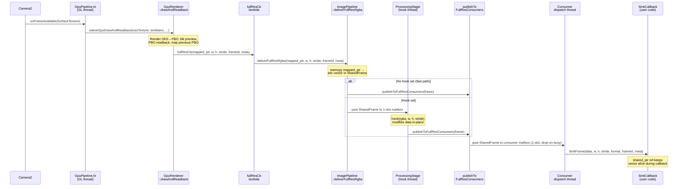
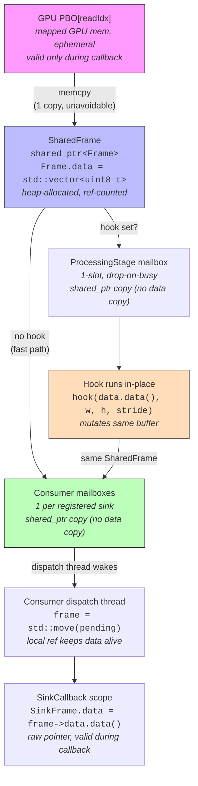

# Camera2 Flutter Plugin Architecture v2

## Quick Reference

A Flutter plugin (`cambrian_camera`) that captures camera frames on Android via Camera2, applies real-time GPU post-processing (brightness, contrast, gamma, saturation, white balance), and delivers processed frames to both a Flutter preview and any number of native C++ consumer sinks.

### Layer map

| Layer | Language | Key file(s) | Role |
|-------|----------|-------------|------|
| L1 Dart Public API | Dart | `lib/src/cambrian_camera_controller.dart` | `CambrianCamera` class, streams, settings |
| L2 Platform Interface | Dart/Kotlin (generated) | `pigeons/camera_api.dart` → `messages.g.dart`, `Messages.g.kt` | Pigeon type-safe bridge |
| L3 Flutter Plugin | Kotlin | `CambrianCameraPlugin.kt` | Plugin entry, TextureRegistry, Pigeon host |
| L4 Camera Controller | Kotlin | `CameraController.kt`, `VideoRecorder.kt`, `GpuPipeline.kt` | Camera2 lifecycle, auto-recovery, recording, GL thread |
| L5 JNI Bridge | C++ | `CameraBridge.cpp` | Deserialize metadata, call pipeline |
| L6 C++ Pipeline | C++ | `ImagePipeline.cpp`, `GpuRenderer.cpp` | GPU rendering, post-processing, consumer fan-out |

All paths are relative to `packages/cambrian_camera/android/src/main/`.

### Key invariants (preserve when modifying code)

- **Preview = consumer output.** The tone-mapped preview is pixel-identical to what `FULL_RES` sinks receive.
- **1 memcpy per frame.** PBO → `std::vector` in `SharedFrame`. All downstream dispatch is `shared_ptr` copy only.
- **No per-frame allocation.** Ring buffers are pre-allocated at sink registration time.
- **`null` = don't change.** `CameraSettings` fields that are `null` retain their previous Kotlin-side values.
- **ISO ↔ exposure are coupled.** Setting either to `auto` propagates to the other via Camera2's single AE flag.
- **LUT rebuilt atomically.** When `ProcessingParams` change, the 256-entry LUT is rebuilt and swapped; no partial updates visible to the frame loop.
- **Latest-value-wins for CameraSettings.** No debounce — in-flight values are replaced, not queued (→ Dart Public API > CameraSettings).
- **Fire-and-forget for ProcessingParams.** No serializer — mutex-protected struct copy in C++, next frame picks up new values.
- **Recording encodes GPU output directly.** MediaCodec surface receives tone-mapped FBO via EGL blit — no CPU YUV copy.

### Section index

| Section | What it covers |
|---------|---------------|
| Context | Purpose, use cases, platform scope |
| Architecture Overview | 6-layer ASCII diagram |
| Key Design Decisions | Pigeon, YUV format, ISP settings, SurfaceProducer, consumer model, auto-recovery |
| Plugin File Structure | Complete directory tree with annotations |
| Dart Public API | `CambrianCamera` class, all types, settings update strategies |
| Platform Bridge | Pigeon interface + JNI metadata layout |
| Kotlin Layer | Auto-recovery state machine + video recording subsystem |
| C++ Pipeline Internals | GPU rendering, frame delivery, buffer ownership, processing stages, consumer fan-out, ring buffers, memory budget |
| C++ Native Consumer API | Public header, sink registration example |
| Testing Strategy | Dart unit, C++ unit, Kotlin integration, on-device tests |

---

## Context

We're designing a unified Flutter plugin (`cambrian_camera`) for controlling a camera on Android (Camera2) with real-time C++ post-processing. The library captures frames, applies user-configurable image adjustments (brightness, saturation, gamma, white balance, etc.), and delivers post-processed frames to both a preview display and any number of native C++ consumers via ring buffers.

**The library is use-case agnostic.** It knows nothing about stitching, tracking, or any specific application. Applications register their own C++ consumers with the configuration they need (resolution, channels, ring size, drop policy). Two known applications:
- A whole-slide imaging scanner performing real-time CV (tracking at low-res, stitching at 4K)
- A slide annotation app capturing and annotating high-quality images

Both need user-adjustable post-processing visible in the preview. The image in the preview is pixel-identical to what consumers receive.

Only Android (Camera2) is implemented initially. The Dart API is platform-agnostic for future iOS support.

---

## Architecture Overview (6 Layers)

```
┌─────────────────────────────────────────────────────────────┐
│  L1: Dart Public API          (packages/cambrian_camera/lib)│
│  CambrianCamera, CameraSettings, ProcessingParams, streams  │
└──────────────────────────┬──────────────────────────────────┘
                           │ Pigeon-generated type-safe interface
┌──────────────────────────┴──────────────────────────────────┐
│  L2: Platform Interface   (Pigeon @HostApi / @FlutterApi)    │
│  CameraHostApi → Kotlin, CameraFlutterApi → Dart callbacks   │
└──────────────────────────┬──────────────────────────────────┘
                           │ Generated Kotlin bindings
┌──────────────────────────┴──────────────────────────────────┐
│  L3: Kotlin FlutterPlugin (CambrianCameraPlugin.kt)          │
│  FlutterPlugin + ActivityAware, TextureRegistry, Pigeon host │
└──────────────────────────┬──────────────────────────────────┘
                           │ direct Kotlin calls
┌──────────────────────────┴──────────────────────────────────┐
│  L4: Kotlin CameraController                                 │
│  Camera2 lifecycle, ImageReader, per-request ISP settings,   │
│  auto-recovery state machine                                 │
└──────────────────────────┬──────────────────────────────────┘
                           │ JNI (DirectByteBuffer + flat arrays)
┌──────────────────────────┴──────────────────────────────────┐
│  L5: C++ JNI Bridge  (CameraBridge.cpp)                      │
│  Deserialize metadata, wrap buffers, call pipeline           │
└──────────────────────────┬──────────────────────────────────┘
                           │ C++ calls
┌──────────────────────────┴──────────────────────────────────┐
│  L6: C++ ImagePipeline                                       │
│  Post-processing, preview output, generic consumer fan-out   │
└─────────────────────────────────────────────────────────────┘
```

---

## Key Design Decisions

### Pigeon over raw MethodChannel

Raw MethodChannel with string-based method names and `Map<String, dynamic>` payloads is error-prone — typos, missing arguments, and type mismatches are caught only at runtime. Pigeon generates type-safe Dart and Kotlin code from a shared interface definition, eliminating this class of bugs.

`@FlutterApi` replaces EventChannel for state/error callbacks.

### YUV_420_888 for streaming

`YUV_420_888` is the streaming format. At session setup `resolveStreamFormat()` queries `StreamConfigurationMap.getOutputSizes(YUV_420_888)`, selects the largest 4:3 size (matching the sensor's native aspect ratio for highest quality), and falls back to 1280×960 if no 4:3 size is advertised. The chosen resolution is reported in `CameraCapabilities.streamWidth` / `streamHeight`.

### Per-request ISP settings

All CameraSettings (ISO, exposure, focus, WB, zoom, NR, edge mode) map to per-request CaptureRequest keys. Changing them rebuilds the repeating request — no session reconfiguration needed.

Session-level changes (stream format/size/buffer count) trigger a full stop/start cycle, but these are rare (only at initialization or explicit resolution change).

### SurfaceProducer for preview

The preview Surface comes from Flutter's `TextureRegistry.SurfaceProducer`. When the surface is invalidated (hot restart, activity recreation), the controller rebinds the capture session to the new Surface — see "Kotlin Layer > Preview rebinding" for the full sequence.

```
Flutter Texture widget
    ↓ (textureId = SurfaceProducer.id, stable across surface recreations)
TextureRegistry.SurfaceProducer
    ↓ getSurface()
Camera2 repeating CaptureRequest target
    ↓ (Camera2 writes YUV frames directly into the Surface)
SurfaceProducer → Flutter compositor re-renders
```

Camera2 writes directly into the `SurfaceProducer` surface as a `CaptureRequest` target — no C++ memcpy on the preview path. JNI is used only for frame delivery to the C++ pipeline.

### Generic consumer model (no use-case knowledge)

The library does NOT have hardcoded "stitcher" or "tracker" outputs. Instead, it provides a generic consumer sink registry. Application C++ code registers sinks with the configuration it needs. The library handles downscaling, channel extraction, and ring buffer management per-sink. See "C++ Native Consumer API" for the registration interface.

### Auto-recovery

The library handles camera errors internally with exponential backoff retry. The Dart layer receives state transitions (including `recovering`) and informational errors, but does not need to implement recovery logic. See "Kotlin Layer > Auto-Recovery State Machine" for the full state diagram.

---

## Plugin File Structure

```
packages/cambrian_camera/
├── pubspec.yaml
├── pigeons/
│   └── camera_api.dart                  # Pigeon interface definition
├── lib/
│   ├── cambrian_camera.dart             # barrel export
│   └── src/
│       ├── cambrian_camera_controller.dart   # CambrianCamera class
│       ├── camera_settings.dart              # CameraSettings, ProcessingParams
│       ├── camera_state.dart                 # CameraState, CameraCapabilities, CameraError, RecordingState
│       ├── camera_settings_serializer.dart   # Latest-value-wins for CameraSettings
│       ├── frame_result.dart                 # FrameResult (actual sensor values from hardware)
│       └── messages.g.dart                   # Generated by Pigeon
├── android/
│   ├── build.gradle.kts
│   └── src/main/
│       ├── AndroidManifest.xml
│       ├── kotlin/com/cambrian/camera/
│       │   ├── CambrianCameraPlugin.kt       # FlutterPlugin + ActivityAware + Pigeon host
│       │   ├── CambrianCameraConfig.kt       # Configuration constants
│       │   ├── CameraController.kt           # Camera2 lifecycle + auto-recovery
│       │   ├── GpuPipeline.kt                # EGL context, GL thread, encoder surface
│       │   ├── VideoRecorder.kt              # MediaCodec/MediaMuxer, drain thread
│       │   ├── VideoRecordingReceiver.kt     # Broadcast receiver for recording state
│       │   ├── MetadataLayout.kt             # Shared metadata array constants
│       │   └── Messages.g.kt                 # Generated by Pigeon
│       └── cpp/
│           ├── CMakeLists.txt
│           ├── include/
│           │   ├── cambrian_camera_native.h   # Public consumer API (NO OpenCV)
│           │   └── MetadataLayout.h           # Shared metadata constants
│           ├── src/
│           │   ├── CameraBridge.cpp           # JNI glue
│           │   ├── GpuRenderer.cpp            # Dual-path GPU rendering (color + raw shaders)
│           │   ├── GpuRenderer.h              # GPU renderer internal header
│           │   ├── ImagePipeline.cpp          # Processing + generic fan-out
│           │   ├── ImagePipeline.h            # Internal header (may use OpenCV)
│           │   ├── InputRing.cpp              # Input ring buffer implementation
│           │   └── InputRing.h                # Input ring buffer header
│           └── test/
│               ├── SinkRoutingTest.cpp        # Consumer sink routing tests
│               └── TrackerDimTest.cpp         # Tracker dimension calculation tests
├── ios/                                       # Stub for future
│   ├── Classes/
│   │   ├── CambrianCameraPlugin.swift         # PlatformException("PLATFORM_NOT_SUPPORTED")
│   │   └── Messages.g.swift                   # Generated by Pigeon (iOS)
│   └── cambrian_camera.podspec
└── test/
    └── camera_settings_serializer_test.dart
```

Key structural notes:
- `pigeons/` directory for Pigeon definitions
- `messages.g.dart` / `Messages.g.kt` / `Messages.g.swift` generated files
- `cambrian_camera_native.h` replaces `CameraPlugin.h` (no OpenCV in public header)
- `ImagePipeline.h` for OpenCV usage (library-internal only)
- `GpuRenderer.cpp/.h` implements dual-path GPU rendering (color + raw shaders)
- `camera_settings_serializer.dart` replaces `camera_settings_queue.dart`
- `frame_result.dart` for actual sensor readback values

---

## Dart Public API

### CambrianCamera

```dart
class CambrianCamera {
  /// Opens camera and starts the pipeline. Single step to a working camera.
  /// Raw stream options (enableRawStream, rawStreamHeight) are fields on
  /// [CameraSettings], not direct params here.
  static Future<CambrianCamera> open({
    String? cameraId,
    CameraSettings? settings,
  });

  /// Closes camera and releases all resources.
  Future<void> close();

  /// Emits the Flutter texture ID for the color-processed preview.
  /// Apps render it with Flutter's Texture widget.
  Stream<CameraTextureInfo> get toneMappedTexture;

  /// Emits the Flutter texture ID for the raw (passthrough) preview.
  /// Only emits if enableRawStream: true was set in CameraSettings.
  Stream<CameraTextureInfo> get rawTexture;

  /// Camera state transitions (ready, streaming, recovering, error).
  Stream<CameraState> get stateStream;

  /// Error events. Non-fatal errors (auto-recovering) are informational.
  /// Fatal errors (permission revoked, camera disabled) require app action.
  Stream<CameraError> get errorStream;

  /// Actual sensor values (ISO, exposure, focus, WB gains) reported by the
  /// camera hardware. Emits ~3 Hz (throttled in native code).
  Stream<FrameResult> get frameResultStream;

  /// Device capabilities, available after open().
  CameraCapabilities get capabilities;

  /// Update ISP-level camera settings (ISO, exposure, focus, WB, zoom).
  /// Uses latest-value-wins serialization — see CameraSettings section below.
  Future<void> updateSettings(CameraSettings settings);

  /// Update C++ pipeline processing parameters (brightness, gamma, saturation, etc.).
  /// Returns a Future that completes when the channel round-trip finishes.
  /// Callers may await to observe errors or ignore for fire-and-forget semantics.
  Future<void> setProcessingParams(ProcessingParams params);

  /// Capture a high-quality still image. Returns the file path.
  Future<String> takePicture();

  /// Returns the current display rotation in degrees CW from portrait (0/90/180/270).
  /// Device-level query, not per-camera.
  static Future<int> getDisplayRotation();

  /// Returns the native pipeline pointer for C++ consumer registration, or null
  /// if the pipeline is not yet initialized.
  /// See "C++ Native Consumer API" for how to use this pointer.
  Future<int?> getNativePipelineHandle();

  /// Starts video recording. Returns (contentUri, displayName) on success.
  /// See "Kotlin Layer > Video Recording" for the full recording architecture.
  Future<(String, String)> startRecording({
    String? outputDirectory,  // MediaStore RELATIVE_PATH; default "Movies/CambrianCamera/"
    String? fileName,         // File name without extension; default timestamp
    int? bitrate,             // bits per second; default 50_000_000 (50 Mbps)
    int? fps,                 // frame rate; default 30
  });

  /// Stops recording and finalizes the file. Returns the content URI.
  Future<String> stopRecording();

  /// Recording state changes (typed enum, not raw strings).
  Stream<RecordingState> get recordingStateStream;
}
```

### CameraSettings

Maps to per-request CaptureRequest keys. Auto-capable settings use sealed types so the three
states (don't change / auto / manual) are explicit at compile time:

```dart
class CameraSettings {
  final AutoValue<int>? iso;          // AutoValue.auto() | AutoValue.manual(800)
  final AutoValue<int>? exposureTimeNs; // nanoseconds; auto is contagious with iso
  final AutoValue<double>? focus;     // diopters; AutoValue.auto() = continuous AF
  final WhiteBalance? whiteBalance;   // WhiteBalance.auto() | .locked() | .manual(gainR,gainG,gainB)
  final double? zoomRatio;
  final NoiseReductionMode? noiseReductionMode; // off / fast / highQuality / minimal / zeroShutterLag
  final EdgeMode? edgeMode;           // off / fast / highQuality / zeroShutterLag
  final int? evCompensation;          // steps; no effect when AE is disabled
  final bool? enableRawStream;        // enable GPU raw (passthrough) stream
  final int? rawStreamHeight;         // height in pixels for raw stream; width auto-computed from aspect ratio
}
```

`null` means "don't change" — the Kotlin side accumulates settings so omitted fields
retain their previous values. ISO and exposure share a single Camera2 AE flag: setting
either to `auto` propagates to the other automatically.

**Update strategy — latest-value-wins serializer** (NOT a time-based debounce):

Each setting change requires a Dart → Kotlin → Camera2 `setRepeatingRequest` round trip. If a new value arrives while the previous is in-flight, the old pending value is replaced. No artificial latency is added.

```dart
// Internally in the platform implementation:
class CameraSettingsSerializer {
  PigeonCameraSettings? _pending;
  bool _inFlight = false;

  void send(PigeonCameraSettings settings) {
    if (_inFlight) {
      _pending = settings;  // replace, don't queue
      return;
    }
    _inFlight = true;
    _hostApi.updateSettings(handle, settings).then((_) {
      _inFlight = false;
      if (_pending != null) {
        final next = _pending!;
        _pending = null;
        send(next);
      }
    });
  }
}
```

### ProcessingParams

Maps to C++ pipeline controls. These affect the GPU color shader applied to every frame on the processed path.

```dart
class ProcessingParams {
  final double blackR, blackG, blackB;   // [0.0, 0.5] per-channel black level
  final double gamma;                     // [0.1, 4.0], 1.0 = identity
  final double brightness;               // [-1.0, +1.0], 0.0 = identity
  final double contrast;                  // [-1.0, +1.0], 0.0 = identity
  final double saturation;               // [-1.0, +1.0], 0.0 = identity (full natural color)
}
```

Note: no `trackingScale` — downscaling is per-consumer, configured at the C++ level.

**Update strategy — fire-and-forget, no serializer:**

These are applied in C++ via a mutex-protected struct copy. The next frame picks up the new values. The Dart → Kotlin → JNI → C++ `setParams()` path is a direct pass-through. One platform channel call per slider tick is negligible compared to the 30fps frame pipeline.

```dart
// In CambrianCamera:
Future<void> setProcessingParams(ProcessingParams params) =>
    _hostApi.setProcessingParams(_handle, params.toCam());
// Callers may await to observe channel errors, or ignore for fire-and-forget.
// No queuing — next frame picks up the new values.
```

### CameraState

```dart
enum CameraState {
  closed,       // camera not open
  opening,      // initializing
  streaming,    // actively delivering frames
  recovering,   // error occurred, auto-recovering
  error,        // fatal error, requires app action
}
```

### RecordingState

```dart
enum RecordingState {
  recording,    // recording is active
  idle,         // not started, or cleanly stopped
  error,        // a recording error occurred
}
```

### CameraCapabilities

```dart
class CameraCapabilities {
  final List<CameraSize> supportedSizes;
  final int isoMin, isoMax;
  final int exposureTimeMinNs, exposureTimeMaxNs;
  final double focusMin, focusMax;
  final double zoomMin, zoomMax;
  final int evCompMin, evCompMax;
  final double evCompensationStep;
  final int streamWidth, streamHeight;  // processed stream resolution chosen by resolveStreamFormat()
  // Raw stream fields — all 0 when raw is disabled (enableRawStream: false or raw init failed)
  final int rawStreamTextureId;   // Flutter texture ID for raw preview; 0 when disabled
  final int rawStreamWidth;       // auto-computed from aspect ratio; 0 when disabled
  final int rawStreamHeight;      // matches rawStreamHeight from CameraSettings; 0 when disabled
}
```

### CameraError

```dart
class CameraError {
  final CameraErrorCode code;
  final String message;
  final bool isFatal;   // false = informational (auto-recovering)
}

// CameraErrorCode is a typedef to the Pigeon-generated CamErrorCode enum.
// Codes are serialized as integer indices — do NOT reorder; only append before [unknown].
// typedef CameraErrorCode = CamErrorCode;
enum CamErrorCode {
  cameraDevice,          // ERROR_CAMERA_DEVICE — fatal hardware failure
  cameraService,         // ERROR_CAMERA_SERVICE — camera service error
  cameraDisconnected,    // camera lost unexpectedly (system reclaim, USB)
  configurationFailed,   // session configuration or rebind failed
  permissionDenied,      // CAMERA permission denied or revoked — fatal
  cameraDisabled,        // ERROR_CAMERA_DISABLED — disabled by policy — fatal
  maxCamerasInUse,       // ERROR_MAX_CAMERAS_IN_USE — too many open — fatal
  cameraInUse,           // ERROR_CAMERA_IN_USE — another app holds the camera
  cameraAccessError,     // CameraAccessException (transient access failure)
  maxRetriesExceeded,    // auto-recovery gave up after max retries — fatal
  previewSurfaceLost,    // Flutter SurfaceProducer was invalidated
  pipelineError,         // C++ processing pipeline error
  settingsConflict,      // invalid settings combination
  unknown,               // catch-all; keep last
}
```

### FrameResult

```dart
class FrameResult {
  final int? iso;                    // actual sensor sensitivity
  final int? exposureTimeNs;         // actual exposure duration (ns)
  final double? focusDistanceDiopters; // actual focus distance (1/metres), 0.0 = infinity
  final double? wbGainR;             // red channel gain from COLOR_CORRECTION_GAINS
  final double? wbGainG;             // green channel gain (avg of greenEven/greenOdd)
  final double? wbGainB;             // blue channel gain
}
```

Delivered via `frameResultStream` at ~3 Hz (throttled in native code to every 10th capture result).

---

## Platform Bridge

### Pigeon Interface Definition

The full definition lives in `packages/cambrian_camera/pigeons/camera_api.dart`. Generated outputs: `lib/src/messages.g.dart` (Dart), `android/.../Messages.g.kt` (Kotlin), and `ios/.../Messages.g.swift` (iOS stub).

**HostApi** (Dart → Kotlin): `open`, `getCapabilities`, `updateSettings`, `setProcessingParams`, `takePicture`, `getNativePipelineHandle`, `startRecording`, `stopRecording`, `getDisplayRotation`, `close`

**FlutterApi** (Kotlin → Dart): `onStateChanged`, `onError`, `onFrameResult`, `onRecordingStateChanged`

### JNI Metadata Layout

Flat arrays for zero-allocation metadata transfer between Kotlin (L4) and C++ (L5/L6). Layout defined in shared constant files that must be kept in sync.

#### MetadataLayout.kt / MetadataLayout.h

Single source of truth for array indices:

```kotlin
// MetadataLayout.kt
object MetadataLayout {
    const val FLOAT_COUNT = 26
    const val FLOAT_FOCUS_DISTANCE = 0
    const val FLOAT_DOF_NEAR = 1
    const val FLOAT_DOF_FAR = 2
    const val FLOAT_FOCAL_LENGTH = 3
    // ... all indices
    const val LONG_COUNT = 5
    const val INT_COUNT = 23
}
```

```cpp
// MetadataLayout.h
namespace cam::meta {
    constexpr int FLOAT_COUNT = 26;
    constexpr int FLOAT_FOCUS_DISTANCE = 0;
    constexpr int FLOAT_DOF_NEAR = 1;
    // ... mirrors Kotlin exactly
}
static_assert(cam::meta::FLOAT_COUNT == 26, "Layout mismatch");
```

#### Future optimization

Replace flat arrays with a packed struct in a shared DirectByteBuffer:

```cpp
struct __attribute__((packed)) PackedMetadata {
    int64_t frameNumber;
    int64_t sensorTimestampNs;
    // ... all fields in fixed order
};
static_assert(sizeof(PackedMetadata) == EXPECTED_SIZE);
```

Kotlin writes via `ByteBuffer.putLong/putFloat/putInt`. C++ casts `GetDirectBufferAddress` to `PackedMetadata*`. Zero deserialization.

---

## Kotlin Layer

### Auto-Recovery State Machine

Implemented in `CameraController.kt`. The library handles camera errors internally — the Dart layer receives state transitions but does not need to implement recovery logic.

```
                    ┌──────────┐
                    │  CLOSED  │
                    └────┬─────┘
                         │ open()
                    ┌────▼─────┐
                    │ OPENING  │
                    └────┬─────┘
                         │ camera opened + session configured
                    ┌────▼──────┐
              ┌────►│ STREAMING │◄────────────────┐
              │     └────┬──────┘                  │
              │          │ error detected           │
              │     ┌────▼───────┐                 │
              │     │ RECOVERING │─────────────────┘
              │     └────┬───────┘  success (retry)
              │          │ max retries exceeded
              │     ┌────▼─────┐
              │     │  ERROR   │  (fatal — app must close/reopen)
              │     └──────────┘
              │
              └── close() from any state → CLOSED
```

#### Recovery behavior

```
error detected → state = RECOVERING (emitted to Dart stateStream)
  → teardown camera resources
  → wait (exponential backoff: 500ms, 1s, 2s, 4s, max 8s)
  → attempt reinit (open device, configure session, rebind preview)
  → success: resume STREAMING, reset backoff counter
  → fail: increment backoff, retry
  → after 5 failures: emit fatal error to Dart, state = ERROR
```

#### Auto-recover from:
- `CameraDevice.StateCallback.onError(ERROR_CAMERA_DEVICE | ERROR_CAMERA_SERVICE)`
- `CameraDevice.StateCallback.onDisconnected()` — USB cameras, system reclaim
- `CameraCaptureSession.StateCallback.onConfigureFailed()`
- `SurfaceProducer.Callback.onSurfaceAvailable()` — Flutter surface recycled (rebind capture session to new Surface)

#### Do NOT auto-recover from (emit as fatal):
- `ERROR_CAMERA_DISABLED` — system policy
- Permission revoked at runtime
- `ERROR_MAX_CAMERAS_IN_USE` — another app has exclusive access

#### Preview rebinding

When the `SurfaceProducer` surface is invalidated (hot restart, activity recreation):
1. Flutter calls `SurfaceProducer.Callback.onSurfaceAvailable()` with the new Surface
2. `CameraController` calls `rebindYuvPreviewSurface(newSurface)`
3. Previous capture session is closed; a new session is created with `newSurface` as the repeating request target
4. `SurfaceProducer.id` (= texture ID) is stable — Dart does not need to rebuild the `Texture` widget

### Video Recording

Video recording encodes the tone-mapped GPU output directly to H.264/HEVC MP4 files. The encoder receives frames via a MediaCodec input surface attached to the GPU pipeline's render thread. Recording is fully lifecycle-aware.

**Key features:**
- Surface-mode `MediaCodec` encoder (GPU blits directly to encoder surface, no CPU YUV copy)
- HEVC preferred, automatic AVC fallback if unavailable
- Configurable bitrate (default 50 Mbps) and fps (default 30 fps)
- MediaStore integration: files saved with `IS_PENDING=1` during recording, cleared on success
- Auto-stop when app backgrounded (`AppLifecycleState.paused`)
- Error handling for disk full, muxer failure, and force-stop during recovery
- Startup cleanup of orphaned `IS_PENDING=1` entries from killed processes

#### Recording architecture

```
Dart startRecording(bitrate?, fps?)
     │
     ├─► CambrianCameraPlugin.startRecording()
     │
     ├─► CameraController.startRecording()
     │   │
     │   ├─► VideoRecorder.prepare(width, height, bitrate, fps)
     │   │   ├─► MediaCodec.configure() [HEVC or AVC]
     │   │   ├─► MediaMuxer(outputUri)
     │   │   └─► spawn drainEncoderLoop thread
     │   │
     │   ├─► gpuPipeline.setEncoderSurface(surface)
     │   │   └─► GL thread: nativeGpuSetEncoderSurface()
     │   │       └─► EGLDisplay.eglCreateWindowSurface(encoderSurface)
     │   │
     │   ├─► isRecording = true
     │   │
     │   └─► emit RecordingState.recording
     │
Camera2 frames stream (30 fps)
     │
     ▼
GpuPipeline glHandler (GL thread)
     │
     ├─► GpuRenderer::drawAndReadback()
     │   │
     │   ├─► (step ①) Render OES → fbo_ (tone-mapping shader)
     │   │
     │   ├─► (step ③) eglMakeCurrent(eglWindowSurface_)
     │   │   └─► glBlit fbo_ → default FB
     │   │       └─► eglSwapBuffers() ──► Flutter Texture (preview)
     │   │       └─► eglMakeCurrent(pbuffer)
     │   │
     │   ├─► (step ④) eglMakeCurrent(eglEncoderSurface_)  [only when recording]
     │   │   └─► glBlit fbo_ → default FB
     │   │       └─► eglSwapBuffers() ──────────► MediaCodec input queue
     │   │       └─► eglMakeCurrent(pbuffer)
     │   │
     │   └─► (steps ⑤-⑥) PBO readback
     │       └─► C++ sinks
     │
MediaCodec drain thread (async)
     │
     ├─► dequeueOutputBuffer (100ms timeout)
     │
     ├─► writeSampleData(trackIndex, buffer) ──► MediaMuxer
     │   │   [if disk full: exception → drainError]
     │   │
     │   └─► releaseOutputBuffer()
     │
     └─► [on EOS] break drain loop, countdown latch
         
Dart stopRecording()
     │
     ├─► CambrianCameraPlugin.stopRecording()
     │
     └─► CameraController.stopRecording()
         │
         ├─► VideoRecorder.stop()
         │   │
         │   ├─► codec.signalEndOfInputStream() ──► [to drain thread]
         │   │
         │   ├─► wait eosLatch (5 sec timeout)
         │   │
         │   ├─► check drainError
         │   │   ├─ if set: delete MediaStore entry, rethrow IOException
         │   │   └─ if null: continue
         │   │
         │   ├─► muxer.stop() [writes moov atom]
         │   │
         │   ├─► SET IS_PENDING=0 (file now visible in gallery)
         │   │
         │   └─► return contentUri
         │
         ├─► emit RecordingState.idle (success) or RecordingState.error (failure)
         │
         └─► isRecording = false
         
Force-stop (during teardown on error or background)
     │
     ├─► CameraController.teardown()
     │   │
     │   ├─► if (isRecording)
     │   │   ├─► videoRecorder.stop() [force-stop, don't wait for EOS]
     │   │   ├─► emit RecordingState.error (via mainHandler.post)
     │   │   └─► isRecording = false
     │   │
     │   └─► close capture session, release camera device
     │
     └─► [on app background] _CameraScreenState.didChangeAppLifecycleState()
         └─► if (paused && _isRecording)
             └─► camera.stopRecording()  [auto-stop, normal flow]
```

#### Recording state machine

```
┌─────────┐
│  IDLE   │
└────┬────┘
     │ startRecording()
     ▼
┌──────────────┐
│  PREPARING   │ (configure codec, muxer, MediaStore entry)
└────┬─────────┘
     │
     ▼
┌──────────────┐
│  RECORDING   │ (encoder consumes frames, drain thread polls output)
└────┬─────────┘
     │ stopRecording()
     ▼
┌──────────────┐
│  STOPPING    │ (wait for EOS, finalize muxer)
└────┬─────────┘
     │
     ▼
┌─────────┐
│  IDLE   │
└─────────┘
```

Error transitions: any step may jump to `ERROR` state and emit `RecordingState.error` to Dart.

#### Threading
- Dart call → main thread → backgroundHandler.post() (Camera2 thread)
- CameraController → backgroundHandler → GPU GL thread (`glHandler.post`)
- Drain thread (separate `HandlerThread`) polls codec output independently
- Error emission posts back to mainHandler for Dart callback

#### MediaStore integration

**Pending entry lifecycle:**
1. `start()` creates entry with `IS_PENDING=1` (invisible to gallery)
2. `stop()` sets `IS_PENDING=0` on success (makes file visible)
3. On error (disk full, muxer failure), entry is deleted via `contentResolver.delete(uri)`
4. If app is killed mid-recording, entry remains `IS_PENDING=1`; cleaned up on next app launch via `cleanOrphanedPendingEntries()`

**Permissions:** No additional write permission is required. This module targets `minSdk = 33`; writing a new `MediaStore` entry via `ContentResolver` with `IS_PENDING = 1` does not require `WRITE_EXTERNAL_STORAGE`. `MANAGE_MEDIA` is a privileged permission not needed for this write flow.

#### Recording error handling

| Scenario | Action | Dart Result |
|----------|--------|-------------|
| Start fails (state invalid, codec init) | Emit error immediately | `RecordingState.error` |
| Disk full during drain | Store exception, rethrow on `stop()` | `RecordingState.error` on stop |
| Muxer failure on `stop()` | Delete pending entry, rethrow | `RecordingState.error` |
| EOS drain timeout (5 sec) | Force stop, continue cleanup | `RecordingState.idle` (best-effort) |
| Force-stop during teardown | Emit error, delete or finalize entry | `RecordingState.error` |

---

## C++ Pipeline Internals

### Dual-path GPU rendering

The GPU renderer (`GpuRenderer.cpp`) runs two shader passes per frame when `enableRawStream` is active:

```
Camera2 → SurfaceTexture → OES texture
  ├── [color shader]       → processedFBO → preview surface + FULL_RES/TRACKER sinks
  └── [passthrough shader] → rawFBO(rawH) → raw preview surface + RAW sinks
```

**Processed path** (always active): The color shader applies all `ProcessingParams` (black balance, brightness, contrast, saturation, gamma) and renders into `processedFBO`. The preview surface and all `FULL_RES`/`TRACKER` sinks receive this output.

**Raw path** (optional, enabled by `rawW_ > 0`): The passthrough shader applies no shader adjustments — output is the Camera2/SurfaceTexture image as-is in RGBA. Rendered into `rawFBO` at `rawStreamHeight` resolution. The raw preview surface and all `RAW` sinks receive this output.

**Failure handling:** If raw initialization fails (EGL surface creation, FBO setup, shader compilation), the failure is logged, `rawW_` is set to `0`, and the processed pipeline continues normally. Callers can confirm raw is active by checking `capabilities.rawStreamWidth > 0` after `open()`.

**Resource budget (raw path):** All raw resources are allocated only when `rawW_ > 0`:

| Resource | Description |
|----------|-------------|
| `rawFBO` | Framebuffer object at `rawW_ × rawH_` RGBA |
| `rawPBOs[2]` | Two pixel buffer objects for async readback (double-buffered) |
| `rawEGLSurface` | Optional EGL surface for raw preview rendering |

Raw resources are released when the pipeline is torn down or when raw init fails.

### Frame delivery (post-GPU readback)

Summary of the data flow (full detail in Mermaid diagram below):

```
Camera2 → GpuPipeline (GL thread) → GpuRenderer::drawAndReadback
  │
  ├─► fullResCb → ImagePipeline::deliverFullResRgba
  │   └─► memcpy PBO → std::vector in SharedFrame  (the 1 unavoidable copy)
  │       ├─► [no hook]  → publishToFullResConsumers (fast path)
  │       └─► [hook set] → mailbox → hook(in-place) → publishToFullResConsumers
  │           └─► per-consumer mailbox (1-slot, drop-on-busy) → dispatch thread → SinkCallback
  │
  ├─► trackerCb → deliverTrackerRgba  (same pattern, 480p)
  └─► rawCb → deliverRawRgba          (same pattern, passthrough)
```



The same pattern applies for tracker (480p) and raw (passthrough) streams via `deliverTrackerRgba` / `deliverRawRgba`.

### Buffer ownership and memory flow

Summary: one memcpy (PBO → vector), then `shared_ptr` copies only through the rest of the pipeline.

```
GPU PBO[readIdx]           (mapped GPU mem, ephemeral — valid only during callback)
     │
     └─► memcpy (1 copy, unavoidable)
         │
         ▼
SharedFrame                (shared_ptr<Frame>, Frame.data = std::vector<uint8_t>, heap, ref-counted)
     │
     ├─► [hook set?] → ProcessingStage mailbox (1-slot, drop-on-busy, shared_ptr copy)
     │                  └─► hook runs in-place: hook(data.data(), w, h, stride)
     │                      └─► same SharedFrame → consumer mailboxes
     │
     └─► [no hook]  → consumer mailboxes (1 per sink, shared_ptr copy)
                       └─► dispatch thread: frame = std::move(pending)
                           └─► SinkCallback scope: SinkFrame.data = frame->data.data()
                               (raw pointer, valid during callback)
```



**Total memcopies:** 1 (PBO → vector). The processing hook and consumer dispatch add only `shared_ptr` copies — pointer copy, no data copy.

**Concurrency guarantee:** When a consumer's dispatch thread does `frame = std::move(pending)`, it takes ownership of the `shared_ptr`. New frames overwrite the mailbox slot but do NOT affect the local ref. The consumer processes its frame safely while newer frames accumulate (and get dropped) in the slot.

### Processing stages (applied to every frame on the processed path)

1. **Black balance** — per-channel level subtraction: `pixel[ch] = max(0, pixel[ch] - blackLevel[ch])`
2. **White balance gains** — per-channel multiply: `pixel[R,G,B] *= wbGains[R,G,B]`
3. **Gamma + histogram + brightness** — single pre-computed 256-entry LUT per channel
4. **Saturation** — RGB luminance-deviation method (NOT HSV conversion)

Stages 2-4 are fused into the LUT where possible. The LUT is rebuilt atomically when ProcessingParams change.

#### LUT precomputation

```cpp
void rebuildLUT(const ProcessingParams& p) {
    for (int i = 0; i < 256; ++i) {
        float v = i / 255.0f;
        v = pow(v, 1.0f / p.gamma);
        v = clamp(v + p.brightness, 0, 1);
        lut_[i] = static_cast<uint8_t>(v * 255);
    }
}
```

#### Saturation (RGB luminance-deviation, NOT HSV)

The reference approach converts RGBA→BGR→HSV→scale S→HSV→BGR→RGBA (4 color space conversions at 4K). Replace with direct RGB saturation:

```cpp
// Per pixel (fused into main loop):
float lum = 0.299f * R + 0.587f * G + 0.114f * B;
R = clamp(lum + sat * (R - lum), 0, 255);
G = clamp(lum + sat * (G - lum), 0, 255);
B = clamp(lum + sat * (B - lum), 0, 255);
```

3 multiplies + 3 adds per pixel instead of 4 color space conversions. Preserves luminance, which is more correct for scientific imaging.

### Consumer fan-out

After GPU rendering and PBO readback, the pipeline fans out to registered sinks. Each sink has its own dispatch thread and 1-slot mailbox.

For each registered sink, the pipeline applies per-sink transforms (downscale, channel extraction) and posts to the sink's mailbox:

```cpp
void fanOut(const SharedFrame& frame, const FrameMetadata& meta) {
    std::lock_guard<std::mutex> lk(sinksMu_);
    for (auto& [id, sink] : sinks_) {
        auto* slot = sink.ring.acquire();
        if (!slot) {
            if (!sink.config.dropOnFull)
                LOGW("Sink '%s' ring full — frame dropped", sink.config.name.c_str());
            continue;
        }

        // Apply per-sink transforms
        cv::Mat output = frame.mat();
        if (sink.config.width > 0 && sink.config.height > 0) {
            cv::resize(output, sink.resizeBuf,
                       cv::Size(sink.config.width, sink.config.height),
                       0, 0, cv::INTER_LINEAR);
            output = sink.resizeBuf;
        }
        if (sink.config.channels == 1 && sink.config.channelIndex >= 0) {
            extractChannel(output, slot->buffer.data(), sink.config.channelIndex);
        } else {
            memcpy(slot->buffer.data(), output.data, output.total() * output.elemSize());
        }

        SinkFrame sinkFrame = buildSinkFrame(slot, sink, meta);
        sink.callback(sinkFrame);
    }
}
```

Preview rendering happens separately in `GpuRenderer` via EGL surface blitting — the FBO is blitted to the Flutter `SurfaceProducer` surface via `eglSwapBuffers`, with no CPU-side memcpy on the preview path.

### Ring buffer design

```cpp
template<typename Slot>
class SlotRing {
    std::vector<Slot> slots_;
    std::mutex mu_;
    // Use shared_ptr so done() closures are safe even if ring is destroyed
    std::shared_ptr<State> state_;

public:
    Slot* acquire();            // returns nullptr if all in use
    void release(Slot* slot);   // marks slot as available
};
```

The `release` function captured in `SinkFrame::release` holds a `shared_ptr` to the ring state, preventing use-after-free if the pipeline is destroyed while a consumer holds a frame.

### Memory management

All ring buffers are pre-allocated at sink registration time. No per-frame allocation.

Memory per sink = `width × height × channels × ringSize`

Example budget for the WSI scanner app (4K = 3840×2160):

| Sink | Resolution | Channels | Ring | Memory |
|------|-----------|----------|------|--------|
| Input ring (ImageReader) | 3840×2160 | 4 (RGBA) | 4 | 133 MB |
| ANativeWindow (preview) | 3840×2160 | 4 (RGBA) | 2 | 66 MB |
| "stitcher" consumer | 3840×2160 | 4 (RGBA) | 4 | 133 MB |
| "tracker" consumer | 960×540 | 1 (green) | 8 | 4 MB |
| **Total (processed only)** | | | | **~336 MB** |

When the raw stream is enabled, additional GPU memory is allocated for the raw path (not counted above):

| Resource | Resolution | Memory |
|----------|-----------|--------|
| rawFBO | rawW × rawH RGBA | e.g., ~8 MB at 1920×1080 |
| rawPBOs[2] (double-buffered) | rawW × rawH RGBA | e.g., ~16 MB at 1920×1080 |
| rawEGLSurface (optional) | rawW × rawH | ~8 MB at 1920×1080 |

---

## C++ Native Consumer API

The consumer-facing header is `packages/cambrian_camera/android/src/main/cpp/include/cambrian_camera_native.h`. Key types: `IImagePipeline` (`addSink`/`removeSink`), `SinkConfig`, `SinkFrame`, `FrameMetadata`, `SinkRole`. It intentionally excludes OpenCV and library internals.

### Consumer registration example (application code)

```cpp
// In the application's native library (e.g., stitcher_jni.cpp)
#include <cambrian_camera_native.h>

static int g_stitchSinkId = -1;
void registerConsumers() {
    auto* pipeline = cam::getPipeline();
    if (!pipeline) return;

    // Full-res RGBA for stitching
    pipeline->addSink({"stitcher", cam::SinkRole::FULL_RES},
                      [](const cam::SinkFrame& frame) {
        // frame.data = full-res RGBA, valid for duration of this callback
    });

    // 480p downscaled RGBA for tracking
    pipeline->addSink({"tracker", cam::SinkRole::TRACKER},
                      [](const cam::SinkFrame& frame) {
        // frame.data = 480p-height RGBA
    });

    // Raw passthrough sink (only when enableRawStream: true was set in CameraSettings)
    pipeline->addSink({"raw_writer", cam::SinkRole::RAW},
                      [](const cam::SinkFrame& frame) {
        // frame.data = passthrough RGBA from rawFBO, no shader adjustments
    });
}
```

The Dart layer can alternatively call `getNativePipelineHandle()` and pass the raw pointer to app native code via FFI, avoiding the need to link directly.

---

## Testing Strategy

### Dart unit tests
- `CameraSettingsSerializer`: latest-value-wins semantics, in-flight replacement
- `CameraSettings` / `ProcessingParams` Pigeon serialization round-trips
- `CambrianCamera` state machine transitions using mock platform interface

### C++ unit tests (Google Test)
- `SlotRing` acquire/release correctness, full-ring behavior, concurrent access
- Post-processing pipeline: feed known input image, verify output matches golden reference
- `FrameMetadata` deserialization from flat arrays matches expected values
- Per-sink transforms: downscale correctness, channel extraction correctness
- Sink routing (`SinkRoutingTest.cpp`): verify frames reach correct sinks by role
- Tracker dimensions (`TrackerDimTest.cpp`): verify 480p downscale math

### Kotlin integration tests
- CameraController state machine transitions (mock CameraDevice if possible)
- Auto-recovery: simulate error → verify state transitions → verify stream resumes
- Per-request settings correctly applied to CaptureRequest

### On-device integration tests
- End-to-end: camera → pipeline → preview visible → consumer receives frames
- Error recovery: revoke camera permission, verify recovery or fatal error
- Preview rebinding: simulate activity recreation, verify preview resumes
- Memory stability: run at 30fps for 5 minutes, verify no memory growth
- ProcessingParams responsiveness: change params, measure latency to preview update
